## 坐标系定义

__激光雷达布置：__

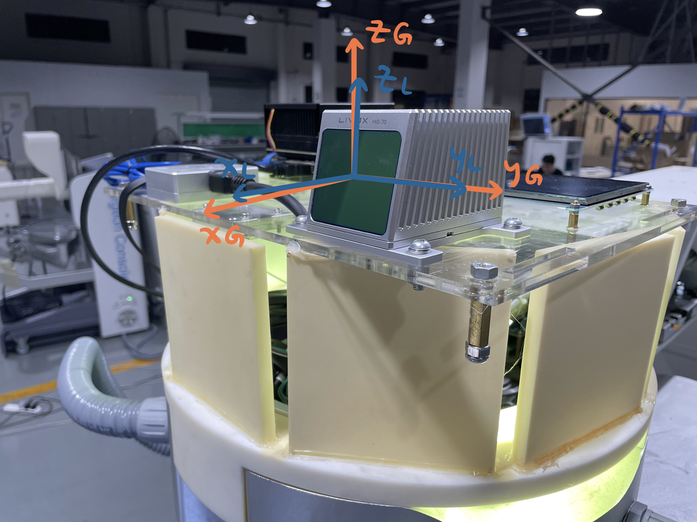

|符号|含义|
|---|---|
|{L}|LiDAR；激光雷达坐标系，x 轴朝向激光雷达正前方，z 轴朝上|
|{G}|Ground；地面坐标系，原点与 {L} 重合，z 轴垂直于地面|
|{R}|Robot；台车坐标系，原点位于两个驱动轮连线的中心，x 轴朝向台车正前方，z 轴朝上|

1. 在初始时刻，台车静止状态下，由 IMU 的加速度方向（重力方向）确定 $^{L0}\mathbf{\hat{z}}_{G0}$
2. $^{L0}\mathbf{\hat{z}}_{G0} \times [1,0,0]^T = ^{L0}\mathbf{\hat{y}}_{G0}$
2. $^{L0}\mathbf{\hat{y}}_{G0} \times ^{L0}\mathbf{\hat{z}}_{G0} = ^{L0}\mathbf{\hat{x}}_{G0}$，进而算出 $^{L0}\mathbf{T}_{G0}$
4. 将任意时刻激光雷达位姿 $^{L0}\mathbf{T}_{Li}$，转换为 $^{G0}\mathbf{T}_{Gi} = ^{G0}\mathbf{T}_{L0} \times ^{L0}\mathbf{T}_{Li} \times ^{L0}\mathbf{T}_{G0}$
5. 进而转换为平面运动控制问题

## 内参估计

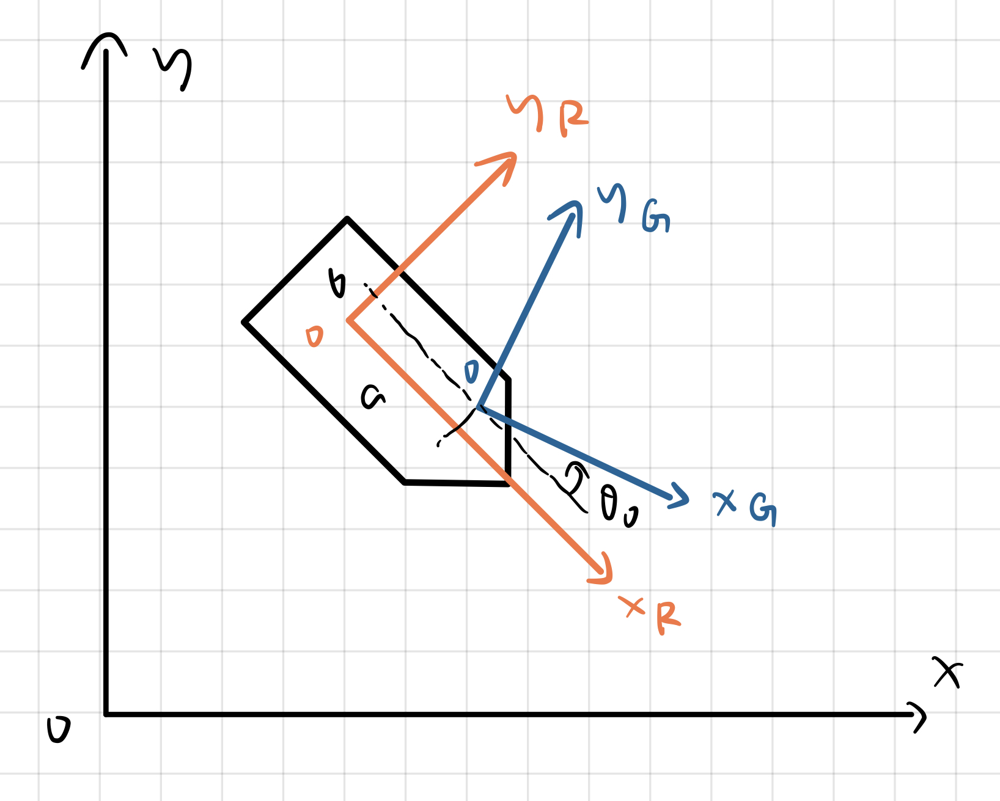

运动控制过程中，需要估计三个内参：$a, b, \theta_0$
1. 其中，$\theta_0$ 通过实验拟合。让台车走直线，比较 {G} 的轨迹与 $\mathbf{x}_G$ 的夹角。
2. 利用运动控制过程中台车位姿的观测值和估计值之差，估计 a, b。
$E = \frac{1}{2} (\tilde{x}^2_{G(k+1)} + \tilde{y}^2_{G(k+1)})$
$\hat{a}_{k+1} = \hat{a}_{k} - \eta \frac{\partial E}{\partial \hat{a}_{k}}$
$\hat{b}_{k+1} = \hat{b}_{k} - \eta \frac{\partial E}{\partial \hat{b}_{k}}$

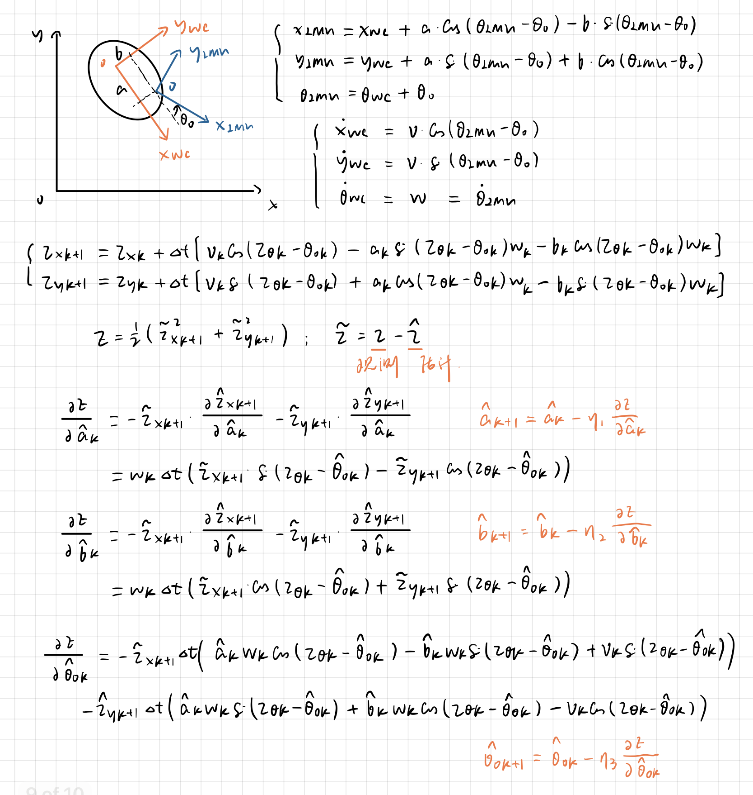

## 内参估计仿真

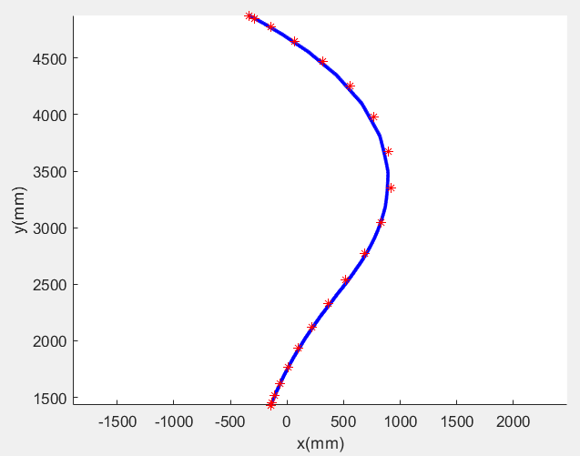
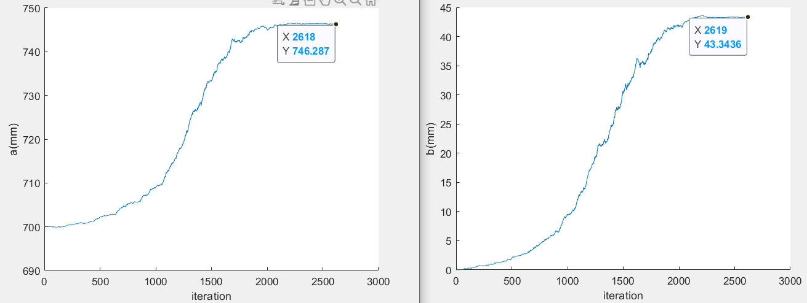

位置观测噪声方差：每步移动量的 20%；角度观测噪声方差：每步旋转量的 20%。
a 真值：759mm；b 真值：50mm
a 收敛到：746.3mm；b 收敛到：43.3mm。(没有收敛到真值是因为：当前 $\eta$ 下，运动轨迹不够长，尤其是转弯的轨迹不够长。最后一段路程基本在走直线，所以收敛速度放缓。)

## 实验

__LIO 位姿估计精度测试__

蓝线为 Manfrotto 055（辰维）捕捉的台车位置 Ground Truth。
黄线为激光雷达自身位置估计结果。

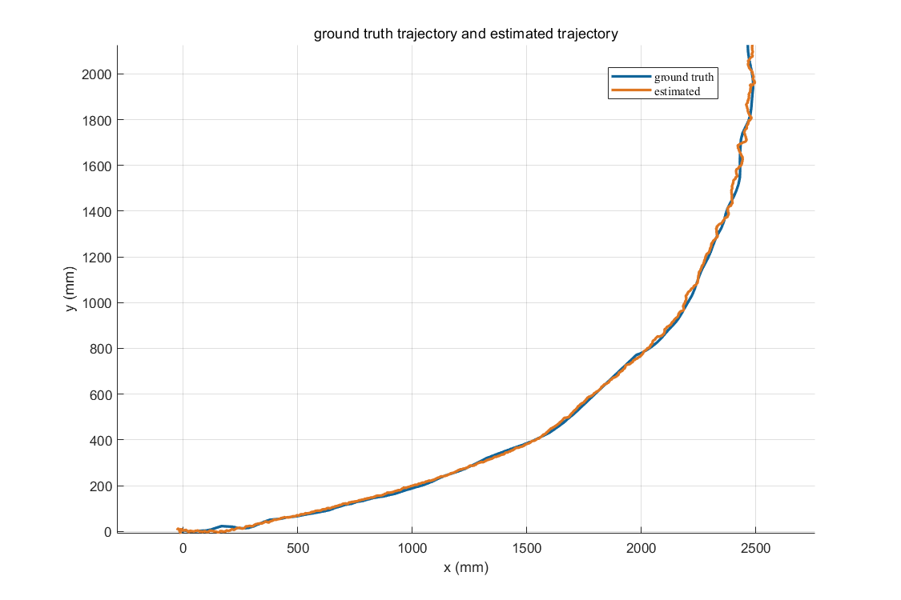
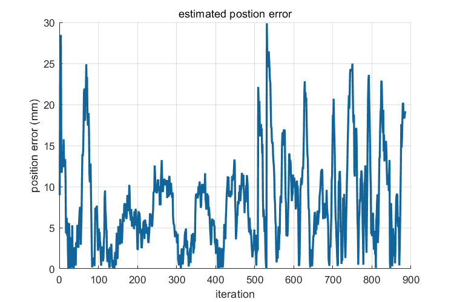
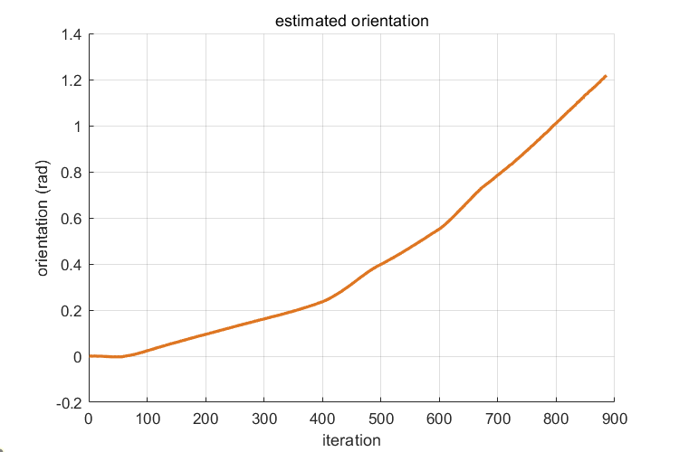

__闭环位姿控制测试__

test1 到位精度：位置误差 7.0134mm；角度误差 0.1490°。

test2 到位精度：位置误差 16.5657mm；角度误差 0.9969°。

test3 到位精度：位置误差 7.2348mm；角度误差 0.3610°。

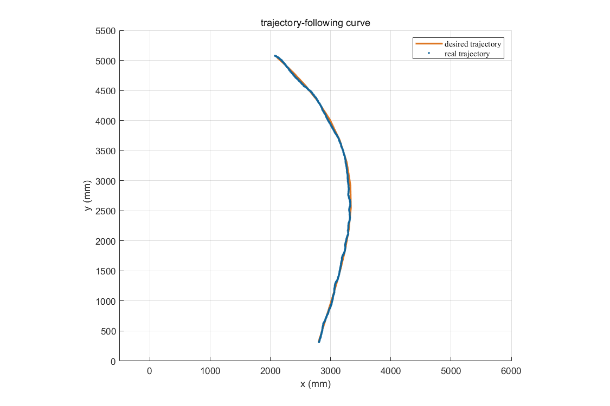
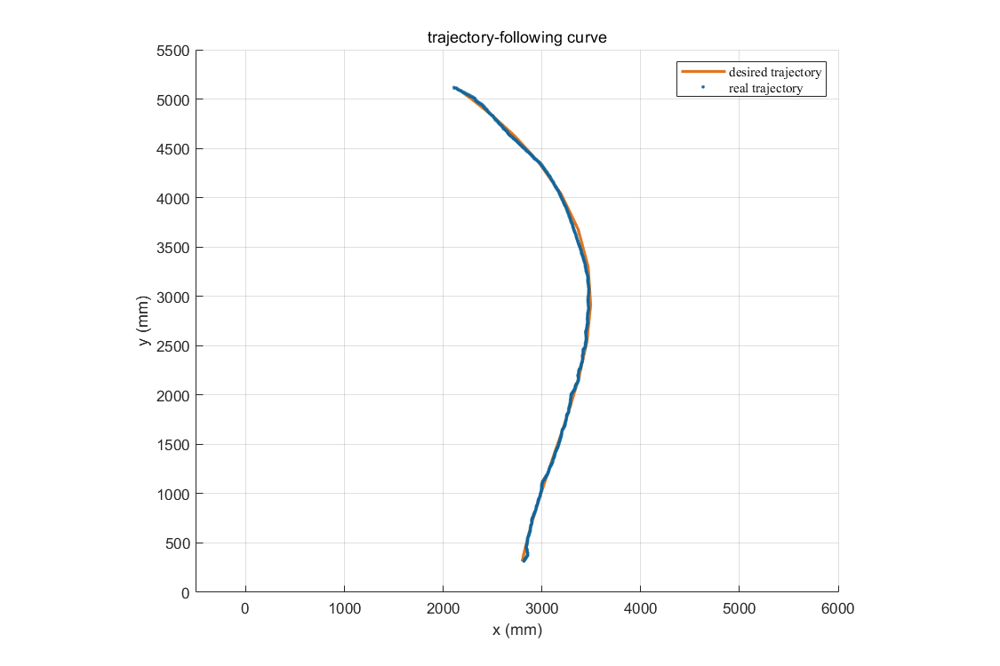
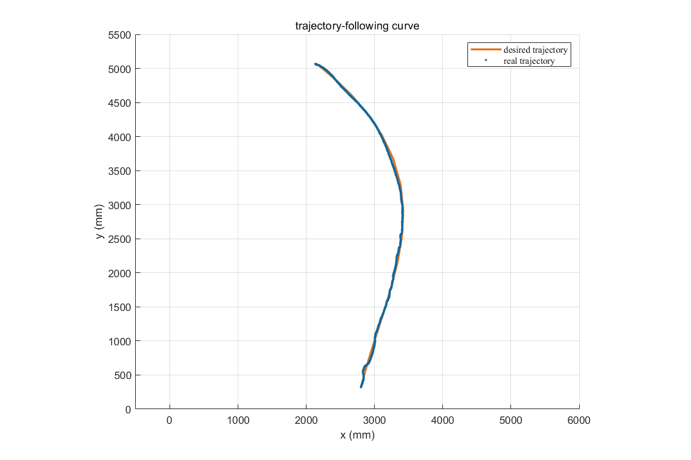

单目自动泊车算法的到位精度：位置误差 3.91mm；角度误差 1.24°。

