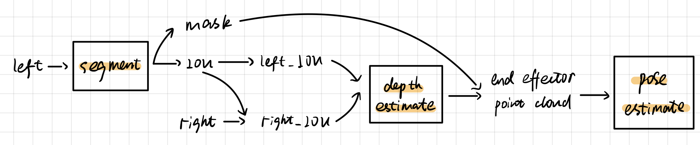

<!-- @import "[TOC]" {cmd="toc" depthFrom=1 depthTo=6 orderedList=false} -->

<!-- code_chunk_output -->

- [Attention is All You Need](#attention-is-all-you-need)
- [LoFTR: Detector-Free Local Feature Matching with Transformers](#loftr-detector-free-local-feature-matching-with-transformers)
- [Revisiting Stereo Depth Estimation From a Sequence-to-Sequence Perspective with Transformers](#revisiting-stereo-depth-estimation-from-a-sequence-to-sequence-perspective-with-transformers)
- [YOLOPose V2: Understanding and Improving Transformer-based 6D Pose Estimation](#yolopose-v2-understanding-and-improving-transformer-based-6d-pose-estimation)
- [PVN3D: A Deep Point-wise 3D Keypoints Voting Network for 6DoF Pose Estimation](#pvn3d-a-deep-point-wise-3d-keypoints-voting-network-for-6dof-pose-estimation)
- [Normalized Object Coordinate Space for Category-Level 6D Object Pose and Size Estimation](#normalized-object-coordinate-space-for-category-level-6d-object-pose-and-size-estimation)
- [Category-Level Articulated Object Pose Estimation](#category-level-articulated-object-pose-estimation)
- [CAPTRA: CAtegory-level Pose Tracking for Rigid and Articulated Objects from Point Clouds](#captra-category-level-pose-tracking-for-rigid-and-articulated-objects-from-point-clouds)
- [GraphRegNet: Deep Graph Regularisation Networks on Sparse Keypoints for Dense Registration of 3D Lung CTs](#graphregnet-deep-graph-regularisation-networks-on-sparse-keypoints-for-dense-registration-of-3d-lung-cts)
- [FoundationPose: Unified 6D Pose Estimation and Tracking of Novel Objects](#foundationpose-unified-6d-pose-estimation-and-tracking-of-novel-objects)
- [点云位姿估计测试](#点云位姿估计测试)

<!-- /code_chunk_output -->

## Attention is All You Need

本文提出了 Transformer 模型，它是继 MLP, CNN, RNN 之后的==第四大深度学习模型==。
ChatGPT 系列网络，UniAD (CVPR 2023 最佳论文) 的底层都使用了 Transformer。

多头注意力（Multi-Head Attention）机制原先是为自然语言处理（NLP）问题而设计的。
每个词源由一个特征向量标识，通过特征向量的点积，比较词源之间的相似程度，建立词源之间的联系。
类比图像处理领域，每个像素也由一个特征向量标识，那么利用 MHA 就可以建立两张图像各个像素之间的联系。

MHA 在图像领域的一大优势在于它具备==全局感受野==，不像 CNN 的感受野受制于 kernel 大小。

## LoFTR: Detector-Free Local Feature Matching with Transformers

__CVPR 2021__

__网络结构：__

1. 特征提取模块：ResNet + FPN (feature pyramid network)
2. 特征转化模块：4 层 Transformer
3. 特征匹配模块：特征向量点积，比较相似度
4. coarse-to-fine 模块：提取亚像素坐标

__训练数据集：__
ScanNet：一对 rgbd 图（无畸变），相机间的坐标变换 T，相机内参

__输入：__
 
960 * 540 pixel

__输出：__

5772 个特征点对，颜色越红置信度越高。

__应用价值：__
自监督的内窥镜单目深度估计
用于视频序列前后帧的视觉里程计计算
参考论文 Reconstructing Sinus Anatomy from Endoscopic Video – Towards a Radiation-Free Approach for Quantitative Longitudinal Assessment (CVPR 2020)

## Revisiting Stereo Depth Estimation From a Sequence-to-Sequence Perspective with Transformers

__CVPR 2020__

__网络结构：__

1. 特征提取模块：DenseNet
2. 特征转化模块：6 层 Transformer
3. 特征匹配模块：利用最优运输（optimal transport）理论，两张图像之间逐行匹配特征

__训练数据集：__
SceneFlow 虚拟数据集

使用神经网络进行深度估计的一大优势在于它除了使用色彩信息还会利用==几何信息==。

详见 depth.blend。

## YOLOPose V2: Understanding and Improving Transformer-based 6D Pose Estimation

__RAS 2023__

RGB Object Pose Estimation 三大类：direct regression methods（由于旋转空间的非线性，此方法的泛化能力较差），keypoint-based methods（哪怕 2D 投影误差小，在真实的 3D 空间中误差仍然可能很大）, and refinement-based methods（迭代一个渲染出来的模型）。

特征提取模块使用 ResNet 从 RGB 图像中提取逐点的特征。
Transformer Encoder 进一步学习逐点的全局特征。
Transformer Decoder 问询 N 个 Object Queries，其中 N 大于图像中目标物体的数量，Object Queries 用随机向量初始化并和网络参数一同更新。
Transformer Decoder 的 N 个输出，代表 N 个目标物体的预测。FFN 就是 MLP。
最后在检测出目标物体的3D关键点之后，使用 RotEst 估计位姿。RotEst 是一种 PnP 的替代。

## PVN3D: A Deep Point-wise 3D Keypoints Voting Network for 6DoF Pose Estimation

__CVPR 2020__

特征提取模块从 RGBD 图像中提取每个点的特征，作为 $M_K M_C M_S$ 的输入。
3D 关键点检测模块预测从可见点到目标关键点的平移偏移量，利用聚类算法挑选群集的中心作为目标关键点。
本文还引入了一个实例分割模块用于处理多物体场景，其中包含一个语义分割模块用以预测逐点的语义标签，一个中心投票模块用以预测逐点相对其物体中心的平移偏移量。
在检测出目标的3D关键点之后，使用最小二乘法拟合位姿。

## Normalized Object Coordinate Space for Category-Level 6D Object Pose and Size Estimation

__CVPR 2019__
__Stanford & Google__

__contributions:__
1. 提出了 Normalized Object Coordinate Space (NOCS)。
2. 构建了一个联合 NOCS map 和 depth map 来做 6D 位姿估计的神经网络。
3. 构建了一种基于混合现实的虚拟数据集生成方法。

__NOCS:__ 将物体归一化到单位立方体空间；将 xyz 与 rgb 一一对应；对物体表面着色。==从 rgb 输入预测 NOCS Map，相当于用色彩特征加强对位姿的约束。这种方法能很好地应对物体被部分遮挡的情况。==

## Category-Level Articulated Object Pose Estimation

__CVPR 2020__

__contributions:__
1. 提出了 Articulation-aware Normalized Coordinate Space Hierarchy (ANCSH)。一个父 NAOCS 包含多个子 NPCS。
2. 构建了一个基于 PointNet++ 的 6D 位姿估计网络。
3. 构建了一个联合 NAOCS map，depth map 和关节信息的位姿优化方程。
4. 不但能估计 6D 位姿，还能估计关节参数。

1. part segmentation，假设有 M 个 part。
2. 逐点预测 NPCS coordinates。
3. 由 NPCS map 转换至 NAOCS map（此时不考虑绕轴旋转）。
4. 使用投票的思想，估计关节参数。

## CAPTRA: CAtegory-level Pose Tracking for Rigid and Articulated Objects from Point Clouds

__ICCV 2021__

1. pose canonicalization：令上一帧坐标系为 $\mathcal{T_t^{(j)}}$，这一步的目的是将 $X_{t+1}$ 转换到 $\mathcal{T_t^{(j)}}$ 下，记为 $Z_{t+1}^{(j)}$。接下来只需要学习位姿的变化量 $\mathcal{\hat{T}_{t+1}^{(j)}}$。
2. pose tracking：由于 ${\hat{R}_{t+1}^{(j)}}$ 接近于单位阵，因此直接回归就能取得不错的效果。${\hat{T}_{t+1}^{(j)}}$ 的计算延用 NAOCS map 的方法。

## GraphRegNet: Deep Graph Regularisation Networks on Sparse Keypoints for Dense Registration of 3D Lung CTs

__TMI 2021__

$I_F, I_M$ 是一对吸气和呼气时的 CT 扫描影像。作者希望学到一张位移图，这张位移图作用在 $I_M$ 上就能得到 $I_F$。

1. 用 Foerstner 算子提取 $I_F$ 中的特征点 P。
2. 用 MIND 描述子计算 $I_F, I_M$ 的稠密特征图 $F_F, F_M$，每个像素的特征向量长 12。
3. 在 $F_M$ 中特征点 P 的邻域内，计算特征向量的相似度，每个特征点 P 会得到一张损失热图 C。
4. 使用 GraphRegNet，由每一张损失热图 C 预测一个位移场 Ds。GraphRegNet 首先是 CNN 编码层，分别作用在每一张损失热图 C 上提取特征向量；第二部分可以看作是 2D 点云的神经网络，同时学到每个特征点 P 的特征向量以及它们之间的位置关系；最后一个部分是 CNN 解码层，分别作用在每个特征 P 上，生成一个位移场 Ds，进而可以确定每个特征 P 的位移量。三线性插值后，得到稠密的位移图。
5. 于是可以根据位移图将 $F_M$ 位移为 $F_F$ 的预测值，并与 $F_F$ 的真值进行比较，作为损失函数用于训练。

## FoundationPose: Unified 6D Pose Estimation and Tracking of Novel Objects

__CVPR 2024 NVIDIA__

__contribution:__
1. We present a unified framework for both ==pose estimation and tracking== for ==novel objects==, supporting both model-based and model-free setups. An object-centric neural implicit representation for effective novel view synthesis bridges the gap between the two setups.
2. We propose a ==LLM-aided synthetic data generation pipeline== which scales up the variety of 3D training assets by diverse texture augmentation.
3. Our novel design of ==transformer-based network architectures== and contrastive learning formulation leads to strong generalization when trained solely on synthetic data.

__3.1. Language-aided Data Generation at Scale__

是一种虚拟数据集生成方法。如果在模型上随机贴 texture，虚拟数据集往往会看起来非常不真实。本文利用 LLM 和 Diffusion model 生成更加逼真的 texture。

__3.2. Neural Object Modeling__

object field 用两个映射来表示：Geometry Network + Appearance Network。

训练好的 object field 用于代替 3D model。

注意：这两个网络的训练需要一组 RGBD 图像。

__3.3. Pose Hypothesis Generation__

* 先目标检测，确定大致的 translation；
* uniformly rotations sampling;
* pose refinement;

__3.4. Pose Selection__

使用 transformer 对每一个 hypothesis 评分，选出置信度最高的 pose。

## 点云位姿估计测试

__位置：__

在 400 片真实体外场景中进行测试。

x 方向误差：0.915 mm
y 方向误差：0.493 mm
z 方向误差：0.872 mm
总误差：1.577 mm

__姿态：__

1. 问题一：当训练集的点云 size 不固定的时候，网络中的 BachNormalize 层会很不稳定，导致预测结果很差。因此规定输入网络的点云 size 为 2k。

2. 在几何特征不明显的部分（持针钳端部），深度估计网络受光影影响明显，因此在制作虚拟数据集时在持针钳的端部增加更大的深度噪声。

3. loss 函数在 objectness loss 部分权重较大，一定程度上阻碍了 orientation 的估计，因此应当放松对 objectness 分类的监督。

4. 调整网络的各层的感知域，挑选效果最好的组合。

5. 训练集为 1w 片虚拟点云集；测试集为 480x270 的双目图。

z 轴误差：3.49°
绕轴旋转误差：7.46°

绕轴旋转误差较大，查下来发现误差源于台阶面。

orr_error.blend

__改进__

__改进结果__

见 0821_orierror.blend

1. 半径滤波，剔除噪声
2. 体素降采样
~~3. 聚类~~
4. 平面拟合
5. 非线性优化，寻找主方向

x 运动范围: 50 mm
z y 运动范围: 30 mm

平均噪声 6.9°。

__改进 2__

1. 加强对 x 轴指向的监督。学习工具头坐标系的 x 轴指向时，之前版本允许往正方形的任意一个顶点收敛。改为只能往所在面的法向收敛。

2. 改进单位向量的描述方法。学习工具头坐标系的 x 轴指向时，之前版本使用单位向量 (x,y,z) 来描述，不紧凑。改为用经纬度来描述这个单位向量。

3. 改进经纬度的 loss 函数。之前版本使用一步回归的方法。改为用分类 + 回归的方法。共 24 类：[0,15],[15,30],...,[345,360] deg。

$$L = L_{class} + L_{regression}$$

2.2k 个投票结果，明显聚成三类。

平均误差：4.16°。

