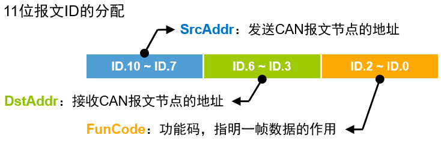

<!-- @import "[TOC]" {cmd="toc" depthFrom=1 depthTo=6 orderedList=false} -->

<!-- code_chunk_output -->

- [简介](#简介)
  - [物理层](#物理层)
  - [数据链路层](#数据链路层)
  - [应用层](#应用层)
- [CAN-bus 节点电路](#can-bus-节点电路)
- [CAN 控制器驱动](#can-控制器驱动)
- [CAN 应用层协议](#can-应用层协议)
- [CAN 节点应用程序](#can-节点应用程序)

<!-- /code_chunk_output -->

## 简介

* 应用层：不关心声音如何传输，只关心自己的意思对方能否理解。（CANopen 定义的是应用层）
* 物理层：不关心信号的意思，只传输频率和幅度不同的振动信号。
* 所谓通信，是指相同层次之间的信息沟通；层与层之间相互独立。

### 物理层

* 对于不同的 CAN-bus 标准（如 ISO11898 和 ISO11519），仅物理层不同。CAN-bus 标准对物理层的信号电平、信号同步与位填充、通信速率与距离以及终端电阻等进行了详细规定。
* 由收发器把逻辑信号转换为物理信号。

* CAN-bus 规定信号的跳变沿时刻进行同步，消除 __波特率__ 误差。

* __终端电阻__ 用于减少通信线路上的反射，避免引起电平变化而导致数据的传输错误。

### 数据链路层

* CAN-bus 通信帧共分为：数据帧、远程帧、错误帧、过载帧和帧间隔 5 种类型。
 

* __数据帧__ 用于发送节点向接收节点传送数据，是使用最多的帧类型，根据仲裁段 ID 码长度的不同，分为标准帧 CAN2.0A 和扩展帧 CAN2.0B。 
* 帧起始：单个显性位 0
* 仲裁段：RTR 远程帧发送标识位 0，SRR 替代远程帧请求位 0，IDE 扩展帧标识位。帧 ID 值越小，优先级越高。数据帧的 RTR 位为显性电平 0，远程帧的 RTR 位为隐性电平 1，所以帧结构和帧 ID 相同情况下，数据帧的优先级高于远程帧。标准帧的 IDE 位为显性电平 0，扩展帧的 IDE 位为隐性电平 1，对于前 11 位 ID 相同的标准帧和扩展帧，标准帧的优先级高于扩展帧。 
* 控制段：r0 r1 保留位，DLC 数据长度代码。
* 数据段：最多传输 8byte
* CRC 段：校验进行数据检错
* ACK 段：提示正确接收
* 帧结束：7 个连续隐性位

* __远程帧__ 用于接收节点向某个发送节点请求数据 

* 错误帧用于当某节点检测出错误时向其他节点通知错误的帧 

* 过载帧用于接收节点向发送节点通知自身接收能力的帧 

* 帧间隔用于将数据帧或远程帧与前面的帧分离开

### 应用层

* 应用层规定设备的工作流程和数据的具体含义。 

* 充分利用报文 ID 储存信息。

## CAN-bus 节点电路

## CAN 控制器驱动

## CAN 应用层协议

没讲啥

## CAN 节点应用程序

