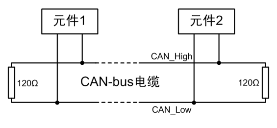
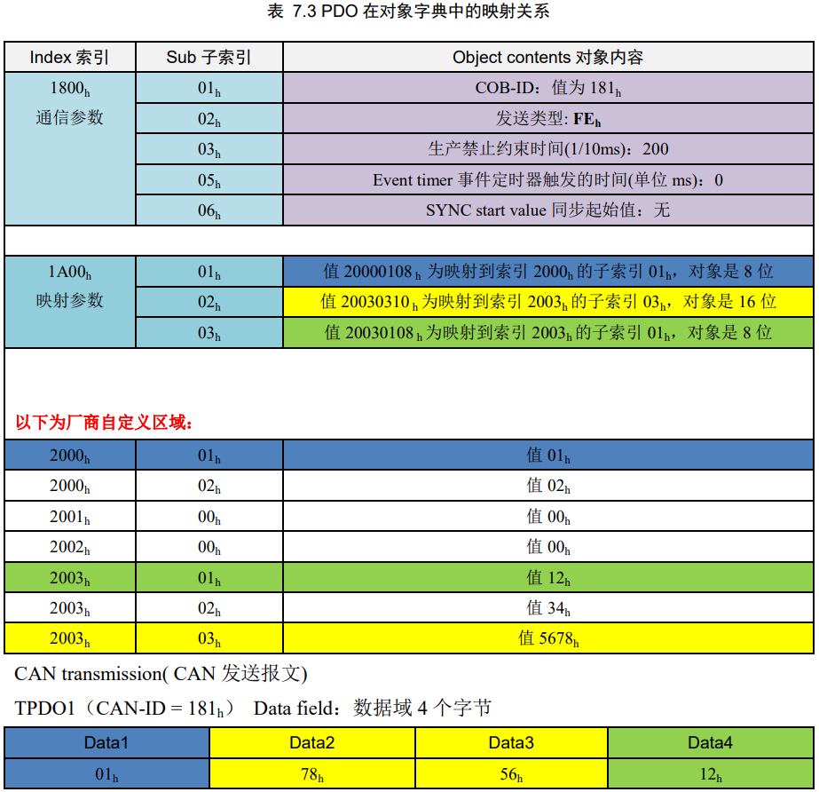

<!-- @import "[TOC]" {cmd="toc" depthFrom=1 depthTo=6 orderedList=false} -->

<!-- code_chunk_output -->

- [CAN-bus](#can-bus)
  - [简介](#简介)
  - [物理层](#物理层)
  - [数据链路层](#数据链路层)
  - [应用层](#应用层)
- [CAN-bus 节点电路](#can-bus-节点电路)
- [CAN 控制器驱动](#can-控制器驱动)
- [CAN 应用层协议](#can-应用层协议)
- [CAN 节点应用程序](#can-节点应用程序)
- [CANopen](#canopen)
  - [CAN-ID](#can-id)
  - [对象字典 OD](#对象字典-od)
  - [网络管理 NMT](#网络管理-nmt)
  - [过程数据对象 PDO](#过程数据对象-pdo)
  - [服务数据对象 SDO](#服务数据对象-sdo)

<!-- /code_chunk_output -->

## CAN-bus

### 简介

* 应用层：不关心声音如何传输，只关心自己的意思对方能否理解。（CANopen 定义的是应用层）
* 物理层：不关心信号的意思，只传输频率和幅度不同的振动信号。
* 所谓通信，是指相同层次之间的信息沟通；层与层之间相互独立。

### 物理层

* 对于不同的 CAN-bus 标准（如 ISO11898 和 ISO11519），仅物理层不同。CAN-bus 标准对物理层的信号电平、信号同步与位填充、通信速率与距离以及终端电阻等进行了详细规定。
* 由收发器把逻辑信号转换为物理信号。

* CAN-bus 规定信号的跳变沿时刻进行同步，消除 __波特率__ 误差。

* __终端电阻__ 用于减少通信线路上的反射，避免引起电平变化而导致数据的传输错误。

### 数据链路层

* CAN-bus 通信帧共分为：数据帧、远程帧、错误帧、过载帧和帧间隔 5 种类型。
 

* __数据帧__ 用于发送节点向接收节点传送数据，是使用最多的帧类型，根据仲裁段 ID 码长度的不同，分为标准帧 CAN2.0A 和扩展帧 CAN2.0B。 
* 帧起始：单个显性位 0
* 仲裁段：RTR 远程帧发送标识位 0，SRR 替代远程帧请求位 0，IDE 扩展帧标识位。帧 ID 值越小，优先级越高。数据帧的 RTR 位为显性电平 0，远程帧的 RTR 位为隐性电平 1，所以帧结构和帧 ID 相同情况下，数据帧的优先级高于远程帧。标准帧的 IDE 位为显性电平 0，扩展帧的 IDE 位为隐性电平 1，对于前 11 位 ID 相同的标准帧和扩展帧，标准帧的优先级高于扩展帧。 
* 控制段：r0 r1 保留位，DLC 数据长度代码。
* 数据段：最多传输 8byte
* CRC 段：校验进行数据检错
* ACK 段：提示正确接收
* 帧结束：7 个连续隐性位

* __远程帧__ 用于接收节点向某个发送节点请求数据 

* 错误帧用于当某节点检测出错误时向其他节点通知错误的帧 

* 过载帧用于接收节点向发送节点通知自身接收能力的帧 

* 帧间隔用于将数据帧或远程帧与前面的帧分离开

### 应用层

* 定义 CAN 报文中的 11/29bit ID 和 8byte Data。

## CAN-bus 节点电路

## CAN 控制器驱动

## CAN 应用层协议

没讲啥

## CAN 节点应用程序

## CANopen

### CAN-ID

* 报文统一使用 11 位的 CAN-ID，以尽量减小传输时间。
* 在 CANopen 里也通常把 CAN-ID 称为 COB-ID（通信对象编号）。

### 对象字典 OD

* 每个 CANopen 设备都有一个 __独立__ 的对象字典。
* 每个对象采用一个 16 位的索引来寻址，范围 0000h to FFFFh；在某些索引下还有一个 8 位的子索引，范围 00h to FFh。

### 网络管理 NMT

* CANopen 网络有一个网络管理主站 NMT-Master。
* 每个 CANopen 从站上线后，为了提示主站它已经加入网络，或者避免与其他从站 Node-ID 冲突，这个从站必须发出 __节点上线报文（boot-up）__。节点上线报文的 CAN-ID 为 __700h+Node-ID__，数据为 1 个字节 0。
* 为了监控 CANopen 节点是否在线与目前的节点状态，CANopen 应用中通常都要求在线的从站定时发送 __状态报文（心跳报文）__。心跳报文的 CAN-ID 也为 __700h+Node-ID__，数据为 1 个字节，代表节点目前的状态，04h 为停止状态，05h 为操作状态，7Fh 为预操作状态。

### 过程数据对象 PDO

* PDO __单向传输__，无需接收节点回应 CAN 报文，从通讯术语上来说属于“生产消费”模型。
* PDO 分为 TPDO（发送 PDO）和 RPDO（接收 PDO），发送和接收是 __以 CANopen 节点自身为参考__。
* __异步传输__：主要是由设备子协议中规定的对象特定事件来触发（例如，定时传输，数据变化传输等）。
* __同步传输__：又分为周期传输（循环）和非周期传输（无循环）。周期传输是通过接收同步对象（SYNC）来实现，可以设置 1~240 个同步对象触发；非周期传输是由远程帧预触发或者由设备子协议中规定的对象特定事件预触发传送。
* RPDO 通信参数 __1400h to 15FFh__，映射参数 __1600h to 17FFh__，数据存放为 __2000h__ 之后厂商自定义区域；TPDO 通信参数 __1800h to 19FFh__，映射参数 __1A00h to 1BFFh__，数据存放为 __2000h__ 之后厂商自定义区域。

* 默认情况下，TPDO1 对应通信参数 1800h，映射参数 1A00h；TPDO2 对应通信参数 1801h，映射参数 1A01h；TPDO3 对应通信参数 1802h，映射参数 1A02h；TPDO4 对应通信参数 1803h，映射参数 1A03h。

### 服务数据对象 SDO

* SDO 需要指定的接收节点 __回应__ CAN 报文来确认已经接收，从通讯术语上来说属于“服务器客户端”模型。
* SDO 主要用于 CANopen __主站对从站的参数配置__。通常 CANopen 从站作为 SDO 服务器，CANopen 主节点作为客户端。客户端通过索引和子索引，能够访问服务器上的对象字典。
* 发起通讯的“问” SDO 的 CAN-ID 是 __600h+Node-ID__，而被问的节点应“答” SDO 的 CAN-ID 是 __580h+Node-ID__，这里的 Node-ID 均为被问（服务器）的节点地址，数据长度均为 8 字节。
* 最常用最常见的 SDO 协议是 __快速 SDO__，所谓快速，就是 1 次来回就搞定。前提是读取和写入的值不能大于 32 位。

