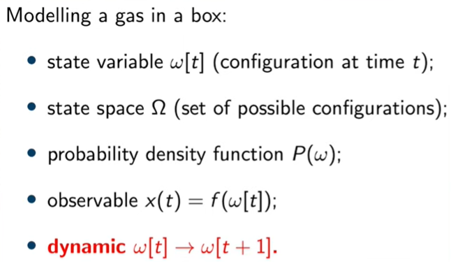

## What is ergodicity?

常用的符号：

应用场景：==surface cleaning, exploration, data collection for learning, localization, surveillance (监视), or manipulation tasks.==

随机过程 $X(t)$ 有 $5$ 个状态变量。有两种统计方法可以描述这些状态变量。==time average：下图绿色框；assemble average：下图红框部分。==

==所谓 ergodicity 是指 time average 与 assemble average 等价的模型。对于此类模型，可以利用 assemble average 的已知信息，规划 time 维度的轨迹，即从 $w[t]$ 预测 $w[t+1]$。==

> ICCRA Tutorial: this workshop tutorial will present different techniques to achieve ergodic control including Spectral Multiscale Coverage (SMC) and Heat Equation Driven Area Coverage (HEDAC).

## Spectral Multiscale Coverage: A Uniform Coverage Algorithm for Mobile Sensor Networks

__Conference on Decision and Control (CDC) 2009__

利用一组搭载传感器的机器人在运动中采集环境信息。但是这种方法不为机器人预先规划覆盖路径, 而是为其设计运动规则。通过不断给机器人一个输入量指引其速度或者加速度, 从而是机器人执行持续的覆盖监控任务。

__理论__

可以分为速度指引和加速度指引两类，本文以速度指引为例。

，

==Our objective is to design trajectories so that the distribution $W_0^t$ is as close to a desired probability distribution $\mu$.==

令 $f$ 为 Fourier basis functions，要求 $c_k, \mu_k$ 应逐项相等。

==Our objective is to choose the controls $u_j(t)$ at time $t$ such that it minimizes $\Phi(t+dt)$ for some small $dt$.==

__实验__

## HEDAC

参考热驱动方程, 根据热力学中热能扩散、对流、冷却等过程，构造势场……

## drozBot: Using Ergodic Control to Draw Portraits

__RAL 2022__

