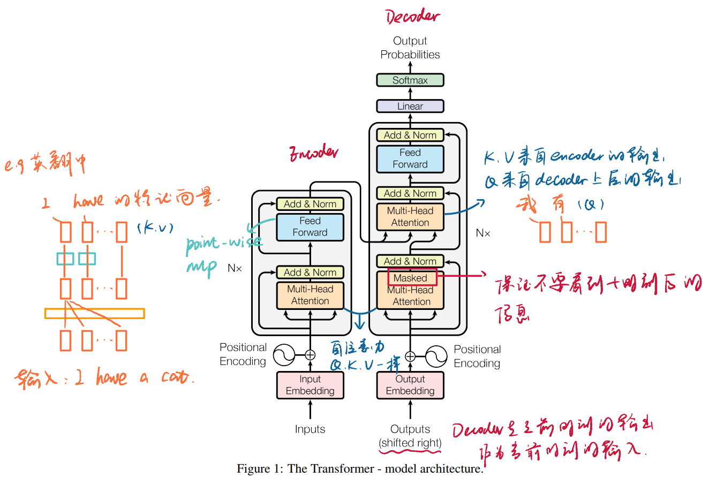
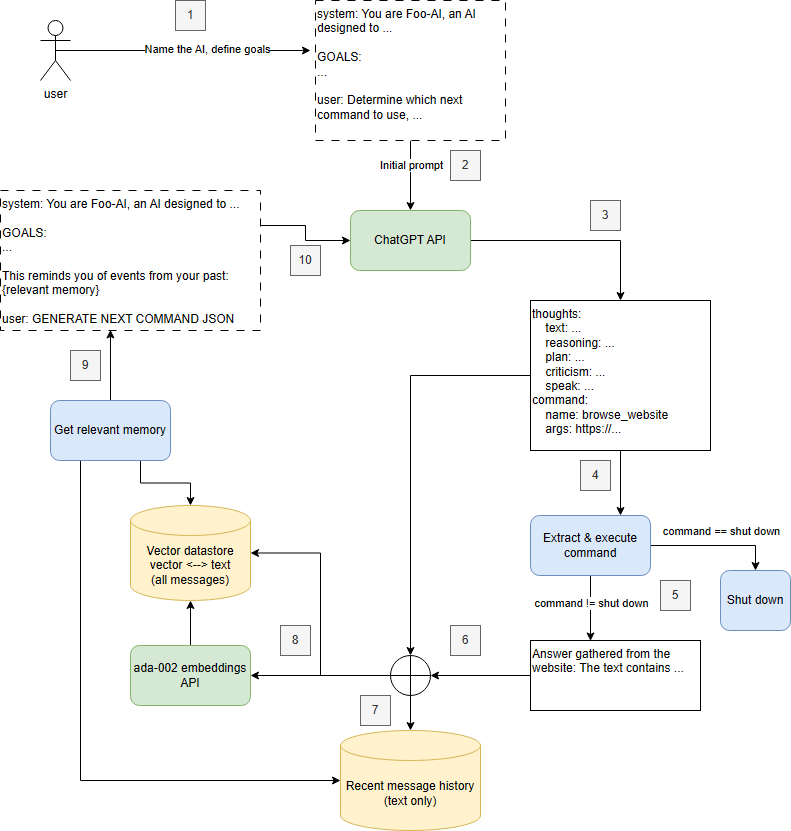
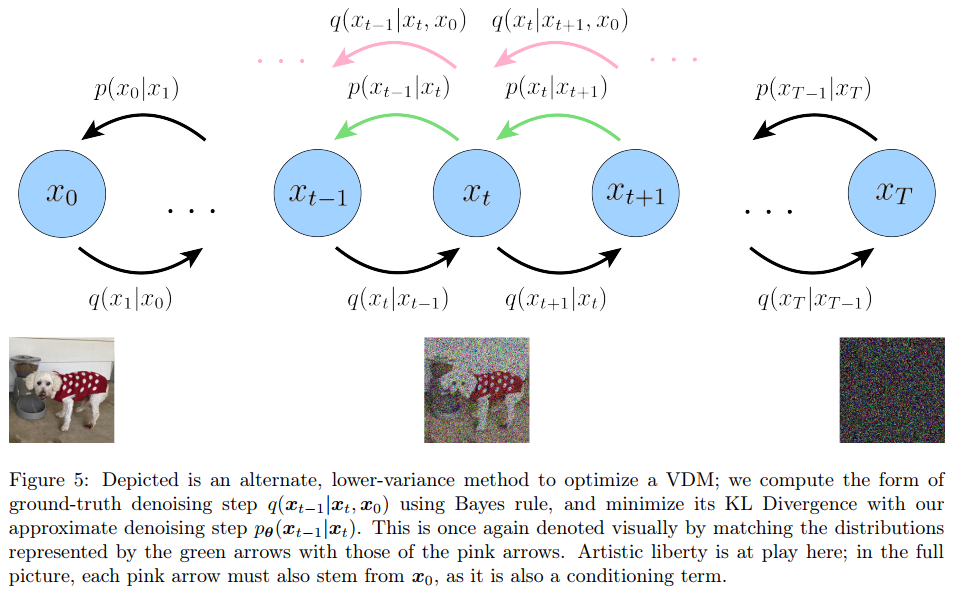

<!-- @import "[TOC]" {cmd="toc" depthFrom=1 depthTo=6 orderedList=false} -->

<!-- code_chunk_output -->

- [文本式 AI 大模型](#文本式-ai-大模型)
  - [引子](#引子)
  - [大模型](#大模型)
    - [大模型的涌现能力](#大模型的涌现能力)
    - [思维链](#思维链)
  - [发展变迁](#发展变迁)
  - [技术细节](#技术细节)
    - [从 RNNs 到 Transformer](#从-rnns-到-transformer)
    - [BERT: Pre-training of Deep Bidirectional Transformers for Language Understanding](#bert-pre-training-of-deep-bidirectional-transformers-for-language-understanding)
    - [Improving Language Understanding by Generative Pre-Training](#improving-language-understanding-by-generative-pre-training)
      - [GPT-2](#gpt-2)
      - [GPT-3](#gpt-3)
      - [InstructGPT & ChatGPT](#instructgpt--chatgpt)
  - [应用范式](#应用范式)
    - [LangChain](#langchain)
    - [Microsoft 365 Copilot](#microsoft-365-copilot)
    - [AutoGPT](#autogpt)
    - [Artificial Intelligence in Surgery: Promises and Perils](#artificial-intelligence-in-surgery-promises-and-perils)
    - [A Survey of Large Language Models for Autonomous Driving](#a-survey-of-large-language-models-for-autonomous-driving)
  - [一些网站](#一些网站)
- [How roboticists are thinking about generative AI?](#how-roboticists-are-thinking-about-generative-ai)
  - [Generative Modeling by Estimating Gradients of the Data Distribution](#generative-modeling-by-estimating-gradients-of-the-data-distribution)
  - [Diffusion Policy: Visuomotor Policy Learning via Action Diffusion](#diffusion-policy-visuomotor-policy-learning-via-action-diffusion)
  - [一些数据集](#一些数据集)
    - [What Matters in Learning from Offline Human Demonstrations for Robot Manipulation](#what-matters-in-learning-from-offline-human-demonstrations-for-robot-manipulation)
    - [Implicit Behavioral Cloning](#implicit-behavioral-cloning)
    - [Relay Policy Learning: Solving Long-Horizon Tasks via Imitation and Reinforcement Learning.](#relay-policy-learning-solving-long-horizon-tasks-via-imitation-and-reinforcement-learning)
  - [测试](#测试)

<!-- /code_chunk_output -->

# 文本式 AI 大模型

## 引子

__GPT-4__

> source: https://openai.com/gpt-4

__DALL·E 3__

> source: https://openai.com/dall-e-3

__generative agents__

> source: https://github.com/joonspk-research/generative_agents

## 大模型

__参数爆炸__

对比 U-Net 的参数量约 8M；PointNet++ 的参数量约 2M。据估计 GPT-4 的参数量达到了 1.76T。

__深度学习届的摩尔定律？__

> Sevilla, Jaime, et al. "Compute trends across three eras of machine learning." 2022 International Joint Conference on Neural Networks (IJCNN). IEEE, 2022.

如果统计不同时代的模型计算量（FLOPs，floating point operations，综合考虑了模型的复杂度，训练集大小，收敛速度），我们会发现，模型计算量翻倍的速度从前机器学习时代两年一番（~ 2010），到机器学习时代半年一番（2010 ~ 2022），再到大模型时代 10 个月一番（2015 ~ 2022）。

### 大模型的涌现能力

在很多知识密集型任务上，随着模型规模的不断增长，模型处理下游任务的能力也不断增强；但是在一些复杂任务上（例如数学逻辑推理），当模型小于某一规模时，模型的性能接近随机；但当规模超过某个临界值时，模型的性能会显著提高。这种无法通过小规模模型的实验结果观察到的质变，称之为涌现能力。
就文本领域而言，如果模型达到 100B，大多数任务可以具备涌现能力。

> Wei, Jason, et al. "Emergent abilities of large language models." arXiv preprint arXiv:2206.07682 (2022).

### 思维链

涌现能力和思维链是大语言模型不断接近人类的关键特征。

> Wei, Jason, et al. "Chain-of-thought prompting elicits reasoning in large language models." Advances in Neural Information Processing Systems 35 (2022): 24824-24837.

## 发展变迁

__文本领域:__
2010 年，Recurrent Neural Networks (==RNNs==) 横空出世。由此发展出了 Long Short-Term Memory (==LSTM==) 和 Gated Recurrent Unit (GRU)。

__图像领域：__
2014 年，Generative Adversarial Networks (GANs) 横空出世。由此发展出了 Variational Autoencoders (VAEs) 和 Diffusion Generative Models。

__不同模态下的网络模型最终出现了交叉：__
2017年，谷歌提出 ==Transformer==，一统江山。如文本领域的 ==BERT== 和 ==GPT== 系列模型，图像领域的 Vision Transformer (ViT) 和 Swin Transformer，都使用 Transformer 作为 backbone。

> Cao, Yihan, et al. "A comprehensive survey of ai-generated content (aigc): A history of generative ai from gan to chatgpt." arXiv preprint arXiv:2303.04226 (2023).

__当 Transformer 已成主流，研究者将目光转向新的训练技巧：__
文本领域 ChatGPT 利用 reinforcement learning from human feedback (==RLHF==) 强化了网络的模仿能力。图像领域也尝试了 stable diffusion 等技术。

## 技术细节

### 从 RNNs 到 Transformer

__Surgical Artificial Intelligence and Innovation Laboratory__

> Ban, Yutong, et al. "Aggregating long-term context for learning laparoscopic and robot-assisted surgical workflows." 2021 IEEE International Conference on Robotics and Automation (ICRA). IEEE, 2021.

__RNNs:__

> Graves A, Graves A. Long short-term memory[J]. Supervised sequence labelling with recurrent neural networks, 2012: 37-45.

$$h_t = g(V \cdot s_t); s_t = f(U \cdot x_t + W \cdot s_{t-1})$$

__LSTM:__

为了解决梯度消失带来的遗忘问题，引入了更加精巧的门控机制。

C 称为==细胞状态==，在不同节点改变得很慢。
==忘记门==决定 C 需要丢弃哪些信息：$f_t = \sigma (W_f \cdot [h_{t-1},x_t] + b_f)$
==输入门==决定 C 需要添加哪些信息：$i_t = \sigma (W_i \cdot [h_{t-1},x_t] + b_i); \tilde{C}_t = tanh(W_c \cdot [h_{t-1},x_t] + b_c)$
更新 C：$C_t = f_t * C_{t-1} + i_t * \tilde{C}_t$
==输出门==决定输出多少 C 的信息：$o_t = \sigma (W_o \cdot [h_{t-1},x_t] + b_o); h_t = o_t * tanh(C_t)$

__Transformer:__

但是串联式的网络终究难以理解长序列中的信息，为了提升并行性，Transformer 诞生了。

> Vaswani, Ashish, et al. "Attention is all you need." Advances in neural information processing systems 30 (2017).

1. 首先关注 Encoder 部分，包含两个模块。Feed Forward 是常规的 MLP。Multi-Head Attention 是文章的核心，每层注意力机制，都具备全局视野。这也导致了巨大的参数量。

2. Decoder 是为了解决输入与输出的长度不等的问题。使用的模块与 Encoder 类似。

> sources: https://jalammar.github.io/illustrated-transformer/

### BERT: Pre-training of Deep Bidirectional Transformers for Language Understanding

__Pre_training:（技术路线）__

> Devlin, Jacob, et al. "Bert: Pre-training of deep bidirectional transformers for language understanding." arXiv preprint arXiv:1810.04805 (2018).

两阶段训练方法：首先用海量的 unlabeled 训练语料做 pre-training；再针对特定的任务用 labeled data 做 fine-tuning。

__Encoder & Transformers:（网络结构）__

顾名思义，使用的是 Transformers 中的 Encoder 结构。
24 个 Encoder blocks，token 的特征向量长度为 1024，16 个 attention heads。模型参数比 GPT 大三倍。

__Deep Bidirectional:（训练方法）__

使用两个创新的自监督任务进行预训练：

1. masked language model：遮挡部分单词，并预测这些单词。
[CLS] my dog is [MASK] [SEP] he likes play ##ing [SEP]

2. next sentence prediction：输入两个句子，判断这两个句子是否是连续的。
[CLS] the man [MASK] to the store [SEP] penguin [MASK] are flight ##less birds [SEP]

### Improving Language Understanding by Generative Pre-Training

GPT 和 BERT 一样，使用两阶段模型。pre-training，训练网络预测下一个单词。fine-tuning，额外增加一层 linear+softmax，完成特定任务。

> Radford, Alec, et al. "Improving language understanding by generative pre-training." (2018).

12 个 Decoder blocks，token 的特征向量长度为 768，12 个 attention heads。

#### GPT-2

> Radford, Alec, et al. "Language models are unsupervised multitask learners." OpenAI blog 1.8 (2019): 9.

zero-shot: without any parameter or architecture modification.
不需要针对特定子任务做微调，往通用人工智能开始转型。

#### GPT-3

暴力出奇迹，在 NLP 领域，能力有了飞升。

> Brown, Tom, et al. "Language models are few-shot learners." Advances in neural information processing systems 33 (2020): 1877-1901.

为了让通用人工智能表现更佳，探索了 few-shot 模式

在 GPT-3 之后，为大模型添加 prompt 的方式越来越多（如 Chain of Thought），它们能让模型在完成任务的过程中拥有更多的中间过程

#### InstructGPT & ChatGPT

研究者发现自监督的大语言模型存在一些问题：如胡说八道，回答一些违反安全和道德伦理的答案……
为了更好地监督大语言模型的行为，RLHF (Reinforcement Learning from Human Feedback) 策略被应用起来。

> Ouyang, Long, et al. "Training language models to follow instructions with human feedback." Advances in Neural Information Processing Systems 35 (2022): 27730-27744.

## 应用范式

### LangChain

LangChain 是一个利用大语言模型开发应用程序的 Python 框架。
embedding 是一个高维向量，指代某个单词的特征。
search 过程会根据 question 从 vector database 中提取 embedding 相似程度高的关键段落。

> https://medium.com/@AndresHerranz/llms-langchain-and-vectorstores-2489a2ea1ef1

### Microsoft 365 Copilot

Microsoft 365 Copilot 是一种协调大语言模型和 Microsoft 365 应用的生产力工具。
1. Copilot 从应用中接收输入提示。
2. Copilot 通过一种 Grounding 技术，利用用户数据库 Graph，对输入提示进行预处理。
3. 与 LLM 进行交互，并完成后处理，最终将响应返还给用户。

> https://learn.microsoft.com/en-us/microsoft-365-copilot/microsoft-365-copilot-overview

### AutoGPT

> https://georgesung.github.io/ai/autogpt-arch/

1. 定义 AI agent 和目标。
2. 一些任务提示词，比如：谷歌搜索，生成图片，读文件……
3. LLM 结合用户输入 1 和提示词 2 生成若干子任务。
4. 调用各类工具完成不同的任务……、

__问题：__
1. 无法区分开发与生产。当 AutoGPT 首次完成某项特定任务的时候，开发阶段已然完成；然而当类似的任务再次出现时，它不得不重头执行一遍全部的操作。
2. AutoGPT 的功能集和推理能力有限，容易陷入死循环。

### Artificial Intelligence in Surgery: Promises and Perils

> Hashimoto, Daniel A., et al. "Artificial intelligence in surgery: promises and perils." Annals of surgery 268.1 (2018): 70.

### A Survey of Large Language Models for Autonomous Driving

传统的自动驾驶方案往往被划分为若干子任务模块：感知模块（周围物体检测、跟踪、语义分割）、预测模块（周围物体轨迹预测）、规划模块（自身轨迹规划）。这种模块化的结构看似更加可靠和安全，但也存在一系列的问题：模块之间的信息传递必然存在损失；不同模块对同一信息的提取会造成计算资源的浪费；模块之间的信息传递会累计误差。

大语言模型（如 GPT-4）如何集成进自动驾驶方案中？

大语言模型对开放世界的认知和推理能力是得到证实的。这个特性能够增强自动驾驶方案的可解释性。

__RT-2 Robotic Transformer 2__

用闭环的方法，利用 GPT 做运动规划。

__MTD-GPT__

用于车辆在十字路口的运动规划。
首先训练若干 expert 网络，每个 expert 专注于特定的任务，如：左转、直行、右转。网络输入为 observation，输出为 action 和 reward，皆为 token 形式。
其次再用 GPT 从若干 expert 的输出中挑选最合适的路径。

__Language Prompt__

输入多视角下的多帧连续图像，并且输入提示词（多模态），如：“正在右转的车辆”；输出目标物体的 Bounding Box。

__HiLM-D__

一次性把感知、预测、规划都搞定。

大型模块 Vision Transformer（用于逐帧提取图像特征），LLM 等都不参与训练。ST-Adapter 用于将逐帧特征转化为包含时间信息的特征。

High-Resolution 模块中，Enumeration Module 的作用在于根据 prompt 关注图像的细小特征（如行人、信号灯），

## 一些网站

__ChatGPT, Generative AI and GPT-3 Apps__
https://gpt3demo.com/

__AgentGPT，AutoGPT 网页版__
https://agentgpt.reworkd.ai/zh

# How roboticists are thinking about generative AI?

> source: https://www.youtube.com/watch?v=w-CGSQAO5-Q

> source: https://techcrunch.com/2023/10/14/how-roboticists-are-thinking-about-generative-ai/

## Generative Modeling by Estimating Gradients of the Data Distribution

__神经网络在学什么？__

> Luo, Calvin. "Understanding diffusion models: A unified perspective." arXiv preprint arXiv:2208.11970 (2022).

图中有两个关键的概率分布：
$q(x_t|x_{t-1})=\mathcal{N}(x_t;\sqrt{\alpha_t}x_{t-1},(1-\alpha_t) I)$
$q(x_{t-1}|x_t,x_0)=\mathcal{N}(x_{t-1};\mu,\Sigma I)$
其中 $\alpha$ 相当于高斯噪声的方差：
$\Sigma=\frac{(1-\alpha_t)(1-\bar{\alpha}_{t-1})}{1-\bar{\alpha}_{t}}$ 已知
$\mu=\frac{\sqrt{\alpha_t}(1-\bar{\alpha}_{t-1})x_t+\sqrt{\bar{\alpha}_{t-1}}(1-\alpha_t)x_0}{1-\bar{\alpha}_t}$ 未知
神经网络的目标是学习 $p(x_{t-1}|x_t)$，使其尽可能地逼近 $q(x_{t-1}|x_t,x_0)$。本质上是在学习关于 $x_0$ 的一个隐势场

> source: http://yang-song.net/blog/2021/score/

__为什么要用退火的方法？__

追溯到分子的布朗运动：
$m\ddot x=-\lambda \dot x + \eta(t); \eta(t)\in \mathcal{N}(0,\sigma ^2 I)$
可以抽象为：
$dx(t)=-\nabla U(x(t))dt + \sigma dBt; dBt\in \mathcal{N}(0,dt I)$；U 即神经网路学习的隐势场
当时间趋向无穷，x 最终会稳定下来，可求得：
$p(x)=\frac{exp(-2U(x)/\sigma^2)}{Z}$；Z 为归一化系数

由于 Z 的计算比较麻烦，所以转而学习：
$\nabla_x \log p(x) = - \frac{2}{\sigma^2} \nabla_x U(x)$
因此出现了这种退火的方法：
$x_{i+1} \leftarrow{x_i + \epsilon \nabla_x \log p(x) + \sqrt{2\epsilon} z_i}; z_i\in \mathcal{N}(0,I)$

__高斯噪声的另一个好处__

训练网络用的损失函数一般设计为：
$\mathbb{E}_{p(x)}[\| \nabla_x \log p(x)-s_\theta (x) \|_2^2] = \int p(x) \| \nabla_x \log p(x) - s_\theta (x) \|_2^2dx$

当图像太有规律时，隐势场的大部分区域都没有得到训练。

__网络的设计__

## Diffusion Policy: Visuomotor Policy Learning via Action Diffusion

> Chi, Cheng, et al. "Diffusion policy: Visuomotor policy learning via action diffusion." arXiv preprint arXiv:2303.04137 (2023).

__task:__ 移动积木到指定位置

__input:__ 前几帧的观测 + 未来几帧的待优化轨迹

__output:__ 未来几帧的优化后轨迹

__网络结构：__

__关键函数：__
==DDPMScheduler.add_noise(naction, noise, timestep)==
对应前向加噪：$x_t = \sqrt{\bar{\alpha}_t}x_0 + \sqrt{1-\bar{\alpha}_t}\tilde{\epsilon}_0; \tilde{\epsilon}_0 \in \mathcal{N}(0,I)$

==Loss function: $MSE(\epsilon_\theta(x_t,t), \tilde{\epsilon}_0)$==

==DDPMScheduler.step(noise_pred, timestep, naction)==
对应反向去噪：$x_{t-1}=\frac{1}{\sqrt{\alpha_t}}(x_t-\frac{1-\alpha_t}{\sqrt{1-\bar{\alpha}_t}}\epsilon_\theta(x_t,t))+\sqrt{\Sigma(t)}\tilde{\epsilon}_0$

__other notes:__
1. the policy extracts the visual representation once regardless of the denoising iterations.
2. scalability to high-dimension output spcaces -> infer a sequence of future actions.
3. We recommend starting with the CNN-based diffusion policy implementation as the first attempt at a new task. If performance is low due to task complexity or hight-rate action changes, then the Time-series Diffusion Transformer formulation can be used to potentially improve performance at the cost of additional training.

## 一些数据集

### What Matters in Learning from Offline Human Demonstrations for Robot Manipulation

> source: https://robomimic.github.io/study/

### Implicit Behavioral Cloning

> source: https://implicitbc.github.io/

### Relay Policy Learning: Solving Long-Horizon Tasks via Imitation and Reinforcement Learning.

> source: https://relay-policy-learning.github.io/

## 测试

__environment:__

__result:__

