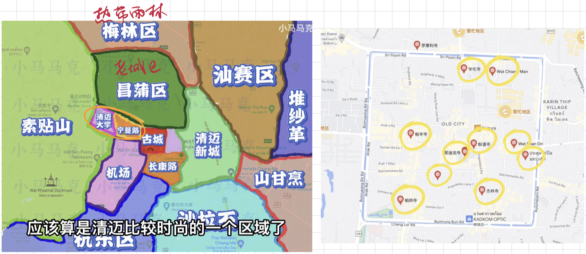
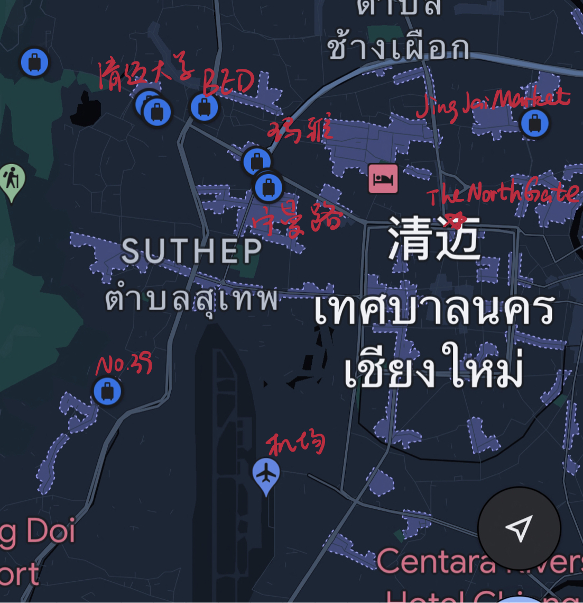
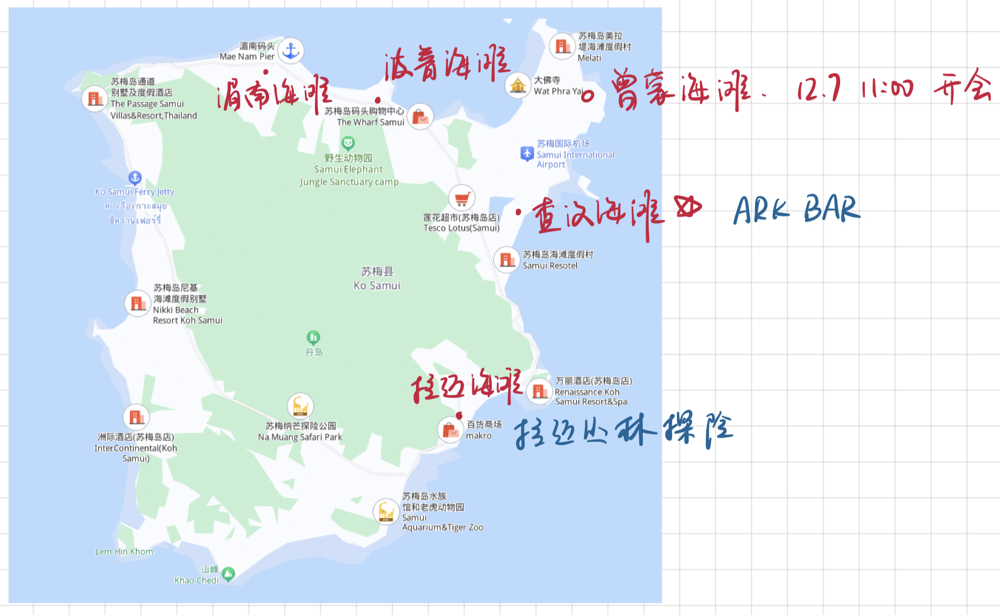

<!-- @import "[TOC]" {cmd="toc" depthFrom=1 depthTo=6 orderedList=false} -->

<!-- code_chunk_output -->

- [清迈](#清迈)
  - [11.29 周三](#1129-周三)
  - [11.30 周四](#1130-周四)
  - [12.01 周五](#1201-周五)
  - [12.02 周六](#1202-周六)
- [曼谷](#曼谷)
  - [12.02 周六](#1202-周六-1)
  - [12.03 周日](#1203-周日)
- [苏梅岛](#苏梅岛)
  - [12.03 周日](#1203-周日-1)
  - [12.04 周一](#1204-周一)
  - [12.05 周二](#1205-周二)
  - [12.06 周三](#1206-周三)
  - [12.07 周四](#1207-周四)

<!-- /code_chunk_output -->

## 清迈

### 11.29 周三

首先万分遗憾的是，我们错过了 28 号的清迈天灯节，实在是太美了，听说那晚好多游客掉落了小珍珠。

上午八点上海的飞机，飞了四个半小时，落地的时候当地时间十一点半，装上了泰国的 happy 电话卡。联系上附近的摩托车租车行，会把摩托车开到机场，清迈之旅正式启动！不太适应摩托车，60 码就感觉好快，没出机场多远，两辆摩托车就在我们眼前相撞，其中一辆飞出去好远，骑手趴在地上不会动了，非常生动的一趟驾驶课……回 BED 酒店休整片刻，就出发去宁曼路啦。宁曼路好有特色，高高的石拱门和顶上吊着的三瓣叶的电扇，慢悠悠地转，我们也慢悠悠地逛。看到了网红的香水店，芒果味的香水俺还是不太能接受；又误打误撞吃了一家米其林餐厅 Kiew Kai Ka，酸酸甜甜地开启泰国美食之旅吧。

下午我们去了古城，帕辛寺、契迪龙寺……还是蛮有氛围的，后来认识的一些朋友跟我们说，他们会带一本书去寺里坐一天，感受禅意。在泰国遍地开花的 711 里买了椰子水，有一说一，711 是我们在泰国最常光顾的餐饮地点。路过了女子监狱；塔佩门鸽子墙肯定也得光顾，但感觉光是看看会有点普通。

晚饭时间去了清迈大学夜市，小吃一路尝过去，泰国女生有点小漂亮，看到了好多 Lisa。换上了当地买的拖鞋，未来的八天再也没有脱下过。本来以为吃完夜市今夜的活动就进入了尾声，没想到只是一个序曲，小梅找到了一家超级棒的爵士酒吧，必须要狠狠表扬，俺疯狂爱上，在清迈的所有晚上，我都必定光顾。The North Gate 每晚会有三个爵士乐队轮番表演，氛围好得不能再好了，在上海我目前还没有探索出如此价格亲民又爵士味纯正的酒吧。在酒吧里，我们还交了三个新朋友：杭州的大悦悦（比我们大五岁？今年辞职开始周游世界），德国的 Benjamin Blumchen（忘记了他的名字……嗜烟如命，自个儿卷烟，为教堂的基金会工作，每年会有一个月的假期，德国好像色情服务是合法的但是质量不佳），比利时的 Emma（因为俺不太懂她的口音，一度非常尴尬……）。总之是非常美丽的夜晚，回到宾馆已经两点啦，睡之前坚持定好了第二天的 Kerchor 大象营地。

忘记是什么时候吃的香蕉饼了，回购 n 次，干净又卫生。

### 11.30 周四

早上爬起来吃了酒店的自助早餐，很棒，然后又躺下睡了，一觉起来已经中午，坐上了去大象营地的车。换上当地服饰，学习大象知识，制作大象的午餐，把芭蕉放进大象的嘴里和鼻子上，看小象喝奶，去泥塘里帮大象按摩，和大象在水塘里一起洗澡。又臭又脏又热，毛还又粗又硬的大象，可真让人喜欢。

晚上先逛了个不知道什么的夜市，买了太阳镜，就直奔 The North Gate，毫无疑问又是一个美丽的夜晚。大象营地的简餐我们根本吃不饱，十二点左右，我们去到了附近的一家自助餐，40 块人民币实现了虾虾自由。回到宾馆又两点了……

### 12.01 周五

老规矩，爬起来吃自助，然后来一个回笼觉。中午左右的时候，出发去粘粘瀑布啦，60 km 的车程，真是飙摩托车的好机会，俺一鼓作气达到了 94 km/h 的最高时速，得瑟死了。粘粘瀑布太美了，都是白人，还碰到了 Emma，她跟我们打招呼，但是我们脸盲没有认出来，太尴尬了救命。后来认识的一些白人朋友们提到清迈都会提到 sticky waterfall，看来这个瀑布在白人圈里非常出名。

从瀑布回来，我们先去感受了一下泰式足底按摩。晚上去吃了一家很棒的牛肉店，据说是因为泰国人不太吃牛肉，这儿的牛肉太便宜了，吃得好过瘾，尤其是牛筋炖得又香又软。吃完之后自然是直奔 The North Gate。

### 12.02 周六

最后一天我们选择感受一下集市，去的是 Jing Jai Market，集市可能都大同小异？后来路过了一个菜市场，吃了百香果、烤鱼和面，牛筋又让我很过瘾。去机场前，最后去 39 号咖啡小坐了一下，树屋泳池咖啡，为清迈之旅画上完美的句号。

## 曼谷

### 12.02 周六

五点半飞到七点，感受了一波曼谷的交通，先是现代化的地铁，再是老派的公交，还有售票阿姨发汽车票的那种，甚至公交车门行驶过程中都不用关，OMG。曼谷坐公交还是要做一下准备，售票阿姨不懂英语，幸好有一个热情的大学小男生帮助我们。非常混搭的城市，就像是成片的窗明几净的商场配上脏乱差的地摊夜市。我们住在双子塔酒店，阴森森的救命。

稍作休整，出门吃了个地摊，牛肉猪肉炒饭，味道依然不错。之后，我们租了电动小三轮，出发去 Nana Square。电动小三轮闪烁着恐怖的绿色光芒，阴气非常重……一路上的交通也是相当复杂，摩托车、三轮车、倒着开的三轮车……Nana Square 里面有一些是 real leady 欸，后面的内容就马掉了吧……

晚上回宾馆我们打了摩的，但是打摩的之前，还碰到一伙骗子，自称迪拜人想看我们的人民币，好在我们是穷游啊。

### 12.03 周日

一觉睡到中午，收拾行李，去 centralwOrld 吃午饭和买乳胶枕头。商场还是蛮好逛的。晚饭 711 里吃泡面，然后我们就飞苏梅啦。

## 苏梅岛

### 12.03 周日

晚上七点一刻的飞机，落地已经九点了，天空还飘着雨。本着穷游的精神，我们淋着雨，走了 3 公里的乡间小路，被雨水淹没的没有路灯的公路，以及好多的土狗，吓坏我了。好不容易抵达 COSI Samui Chaweng 酒店，早早的休息了。到了 Samui 才知道每年有两个雨季，我们刚好赶上了其中一个，哭泣。

### 12.04 周一

酒店没有早餐，上午我们去附近随便吃了点 branch，被蚊子咬死了，我在国内是蚊子绝缘体欸。吃完午饭，我们先去租了一辆摩托车，接着去到 Chaweng beach 游泳，因为一开始没有摩托车，所以很短的路程也走了很久。换上泳裤，直奔大海，这里的浪又短又大，怪不得没有人冲浪，而且游泳也没有什么保护措施，有一说一还是有点危险的。但是海可真漂亮。游累了之后，我们就去 MELIA 报到啦，在海岛上骑摩托别有风味，道路上下起伏，美丽的海景随时可能映入眼帘。

报完道我们去了一家当地的自助餐夜市，依然是 40 人民币实现了海虾自由，小梅吃得很过瘾，狗狗很聪明也很识趣地在附近溜达来溜达去，乖乖等着游客赏肉吃。酒足饭饱，我们去了 Coco Tam's，看烟火秀，喝椰子汁，看椰子树在海风下慢悠悠地飘动，看满天的星星讨论哪颗是北极星，聊童年现在和未来，惬意啊，惬意啊。最后以一场泰式捏脚结束今天的活动，很完美。

### 12.05 周二

起床后，先定了明天的跳岛游。今天我们骑着摩托去环岛游，一家本地参厅吃了午餐，先去拉迈海滩附近的祖父祖母石，雨说来就来，我们紧急找了个咖啡馆，开始撸猫。雨过天晴，我们出发去一号瀑布和二号瀑布，二号瀑布很漂亮，但也有点危险，非常原始的景色，爬着山间泥泞的小路和吊桥一路往上走，沿途都是各种瀑布景观，就是在这儿俺一不小心把脚指头敲肿了，导致在未来的几天里成为了瘸子。后来当地的朋友跟我说，两天前就是在二号瀑布死了个游客，原来我已经算幸运儿了。说起这个当地的朋友，虽然咱俩的英文发音都不太标准，但是口音的频道还挺搭的。最后一瘸一拐坚持走完了 magic garden，打道回府。

晚餐小梅代我去吃了 ROBIO 的自助餐晚宴，据说价值 500 人民币，但是他说难吃无比。而我问 ROBIO 善良的工作人员借了笔记本，修改我的会议汇报 PPT，魔幻。将近八点的时候，终于改完啦，安心了。接着小梅又去做了泰式全身按摩，而我一瘸一拐地去 ARK Bar。这儿有和 Coco Tam's 同款的烟火秀，但我感觉没有 Coco Tam's 的氛围好，我点了杯红酒，游了泳，吹着海风，看情侣在泳池里拥抱亲吻，我一瘸一拐，竟然有点微醺，是不是假酒。

### 12.06 周三

一大早，我们去跳岛游啦。平生第一次带隐形眼镜，再搭配地摊太阳镜，穷游得非常彻底。一瘸一拐，抵达了快艇码头。上快艇后，俺当仁不让挑了最前头的露天座位，骑着海浪，向涛岛飞驰，将近一小时的海程，好多人晕船了，我没吃晕船药，但是并没有晕，谁让俺们是海上男儿。船上我认识了伦敦的一个 99 年的哥们，蓝眼睛，高的很，金融圈的，爱打橄榄球 rugby，九点下班，每年有 20 天的年假，向我吐槽伦敦高昂的房价，看来各国的年轻人都很 struggle 啊。

上午去了两个浮潜点，海下的珊瑚、大鱼小鱼、海参海胆，俺一瘸一拐，有趣的不得了。自助餐很简单，但是我们大快朵颐，对不起亚洲小个子可真能吃。饭后我们去了南园岛，太漂亮了，狭长的海滩，左边是海右边还是海，要是我脚没事，肯定要游个痛快。雨说来就来，浅浅欣赏一下小雨下的海滩吧。回城的船上已然飘着雨，所有游客都躲回船舱了，只有我一个坐在露天的船头，再次乘风破浪，吼，好爽啊。

晚上，我们去了当地的一家夜市，两块钱的寿司，很多肉的烧烤，泰式甜点，齁甜齁甜，但味道很棒。吃完饭，小梅又想按摩了，俺醉了，陪他按一下吧。

### 12.07 周四

一早爬起来整理演讲稿，俺可真极限，上午会议室里照本宣科了一下，俺惭愧。吃了点 ROBIO 的简餐，下午我们开始泡 MELIA 的泳池，两千一晚的酒店，确实有点东西。最后赶飞机回国啦，又认识了两个德国情侣，来度了三个星期的蜜月。在曼谷转机的时候，还是东赶西赶的，退税，买纪念品，很忙。

到上海的时候是早上五点半，我一瘸一拐地结束了快乐的泰国之旅。

