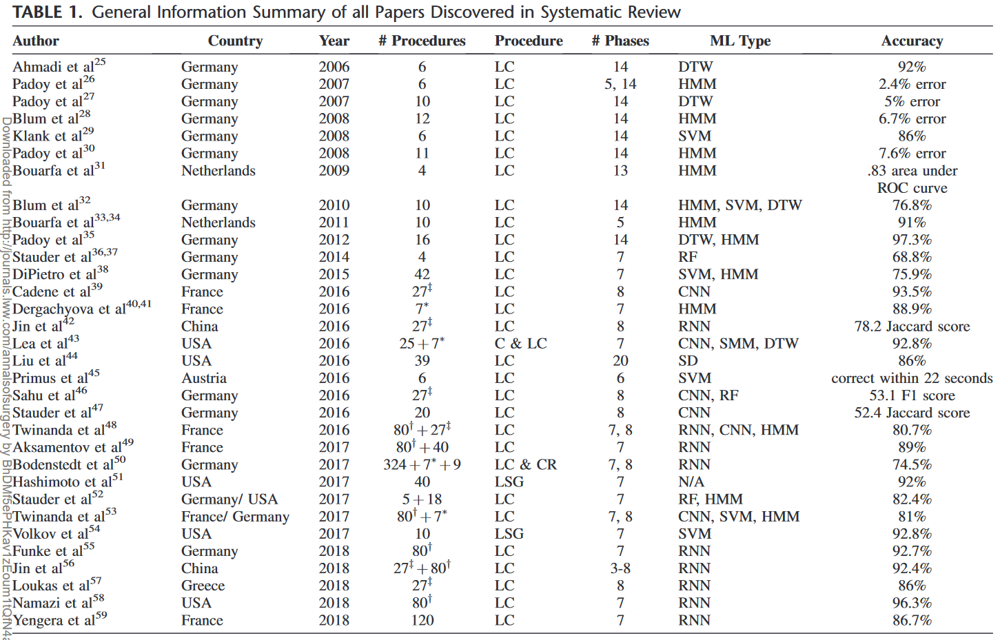

<!-- @import "[TOC]" {cmd="toc" depthFrom=1 depthTo=6 orderedList=false} -->

<!-- code_chunk_output -->

- [1. TEsoNet: knowledge transfer in surgical phase recognition from laparoscopic sleeve gastrectomy to the laparoscopic part of Ivor–Lewis esophagectomy](#1-tesonet-knowledge-transfer-in-surgical-phase-recognition-from-laparoscopic-sleeve-gastrectomy-to-the-laparoscopic-part-of-ivorlewis-esophagectomy)
- [2. Application of artificial intelligence in oncologic surgery of the upper gastrointestinal tract](#2-application-of-artificial-intelligence-in-oncologic-surgery-of-the-upper-gastrointestinal-tract)
- [3. Concept Graph Neural Networks for Surgical Video Understanding](#3-concept-graph-neural-networks-for-surgical-video-understanding)
- [4. SUPR-GAN: SUrgical PRediction GAN for Event Anticipation in Laparoscopic and Robotic Surgery](#4-supr-gan-surgical-prediction-gan-for-event-anticipation-in-laparoscopic-and-robotic-surgery)
- [5. A Deep Concept Graph Network for Interaction-Aware Trajectory Prediction](#5-a-deep-concept-graph-network-for-interaction-aware-trajectory-prediction)
- [6. Artificial intelligence prediction of cholecystectomy operative course from automated identification of gallbladder inflammation](#6-artificial-intelligence-prediction-of-cholecystectomy-operative-course-from-automated-identification-of-gallbladder-inflammation)
- [7. Automated operative phase identifcation in peroral endoscopic myotomy](#7-automated-operative-phase-identifcation-in-peroral-endoscopic-myotomy)
- [8. Surgical data science and artificial intelligence for surgical education](#8-surgical-data-science-and-artificial-intelligence-for-surgical-education)
- [9. SAGES consensus recommendations on an annotation framework for surgical video](#9-sages-consensus-recommendations-on-an-annotation-framework-for-surgical-video)
- [10. Surgeons and Machines Can Learn From Operative Video: Will the System Let Them?](#10-surgeons-and-machines-can-learn-from-operative-video-will-the-system-let-them)
- [11. The Surgical Program in Innovation (SPIN): A Design and Prototyping Curriculum for Surgical Trainees](#11-the-surgical-program-in-innovation-spin-a-design-and-prototyping-curriculum-for-surgical-trainees)
- [12. Artificial Intelligence for Intraoperative Guidance: Using Semantic Segmentation to Identify Surgical Anatomy During Laparoscopic Cholecystectomy](#12-artificial-intelligence-for-intraoperative-guidance-using-semantic-segmentation-to-identify-surgical-anatomy-during-laparoscopic-cholecystectomy)
- [13. Computer vision in surgery](#13-computer-vision-in-surgery)
- [14. Machine Learning for Surgical Phase Recognition: A Systematic Review](#14-machine-learning-for-surgical-phase-recognition-a-systematic-review)
- [15. Challenges in surgical video annotation](#15-challenges-in-surgical-video-annotation)
- [16. Aggregating Long-Term Context for Learning Laparoscopic and Robot-Assisted Surgical Workflows](#16-aggregating-long-term-context-for-learning-laparoscopic-and-robot-assisted-surgical-workflows)
- [17. Artificial Intelligence in Anesthesiology: Current Techniques, Clinical Applications, and Limitations](#17-artificial-intelligence-in-anesthesiology-current-techniques-clinical-applications-and-limitations)
- [18. Artificial Intelligence in Surgery: Promises and Perils](#18-artificial-intelligence-in-surgery-promises-and-perils)
- [19. Computer Vision Analysis of Intraoperative Video: Automated Recognition of Operative Steps in Laparoscopic Sleeve Gastrectomy](#19-computer-vision-analysis-of-intraoperative-video-automated-recognition-of-operative-steps-in-laparoscopic-sleeve-gastrectomy)

<!-- /code_chunk_output -->

https://www.saiil.org/projects-1

## 1. TEsoNet: knowledge transfer in surgical phase recognition from laparoscopic sleeve gastrectomy to the laparoscopic part of Ivor–Lewis esophagectomy

__Surgical Endoscopy 2023 (4.584)__

迁移学习：是机器学习中解决训练数据不足这一基本问题的重要工具。迁移学习通过运用已有的知识来学习新的知识，其核心是找到已有知识和新知识之间的相似性，通过这种相似性的迁移达到迁移学习的目的。
本文运用手术阶段识别网络已有的关于 laparoscopic sleeve gastrectomy 手术（腹腔镜袖状胃切除术）的知识，来学习新的关于 laparoscopic part of Ivor–Lewis esophagectomy 手术（Ivor-Lewis食管切除术的腹腔镜部分）的知识。解决了 laparoscopic part of Ivor–Lewis esophagectomy 手术的视频数据集非常稀少的问题。

1. 作者为 laparoscopic part of Ivor–Lewis esophagectomy 手术定义了十个手术阶段；并且比较了两种手术各个手术阶段的异同；为两种手术共标注了四十段视频（每段视频再细分为八秒一小节，作为网络输入）。
2. 依托现成的手术阶段识别网络（CNN+LSTM），探索在不同权重的训练集组成下（使用不同比例的两种手术训练集），该网络的知识迁移能力。

## 2. Application of artificial intelligence in oncologic surgery of the upper gastrointestinal tract

## 3. Concept Graph Neural Networks for Surgical Video Understanding

针对腹腔镜胆囊切除术，实现手术阶段识别。
使用 graph neural networks 来理解手术视频。其核心在于：首先将视频场景理解为一个个 node（包括具体实物：分割器、胆囊；和抽象概念：切开操作）；其次将 node 信息和视频场景翻译为更高层次的 hyperedge（如分割器剖开胆囊腹膜）。node 和 hyperedge 共同构成了 graph。每个 node 和 hyperedge 都由一个 LSTM 节点单独表示并更新。
此处还涉及一个关键问题：哪些 node 之间存在相互关联，应该被包含进同一个 hyperedge。本文另一大工作量在于定义 node 和 hyperedge 关系图。
这种 graph 结构使网络除了能识别当前手术阶段，还能理解更具体的问题（如当前手术工具的位姿、组织是否出血）

1. 提出了 ConceptNet 网络框架，用于对手术视频中的 node 和 hyperedge 进行在线时间推理。
2. 针对腹腔镜胆囊切除术，定义 node 和 hyperedge 关系图。
3. 实验验证网络的性能优势。

## 4. SUPR-GAN: SUrgical PRediction GAN for Event Anticipation in Laparoscopic and Robotic Surgery

__RA-L 2022__

针对腹腔镜胆囊切除术（稳定的腹腔镜视野与高度标准化的流程）。手术过程中胆管损伤的发生率高达 3%，威胁病人的生命健康。提前识别手术过程中的不当操作，预测和避免像胆管损伤这样的不良事件，能一定程度上提升手术的安全性。
使用 CNN+LSTM 理解当前手术阶段，进而预测 future phase trajectories。使用 GAN 思想，训练 discriminator 来区分真/假 future phase trajectories，使预测尽可能逼真。

1. 定义并探索手术阶段预测问题。
2. 使用 GAN 思想，监督手术阶段预测任务。
3. 实验验证网络的性能优势。

## 5. A Deep Concept Graph Network for Interaction-Aware Trajectory Prediction

__ICRA 2022__

使用 graph neural networks 来理解车辆轨迹。根据过去一段时间内的车辆轨迹，理解车辆间 interaction，进而预测未来一段时间内的车辆轨迹。
将车辆（agent）定义为 node，将 interaction 定义为 edge。node 和 edge 共同构成了 graph。每个 node 和 edge 都设计成 LSTM encoder-decoder 结构。信息由 node
传进 edge，再由 edge 传回 node，因而该轨迹预测算法能够充分利用车辆间的交互信息。

1. 提出了 ConceptNet 网络框架，能在车辆轨迹预测时充分考虑车辆间交互信息（将 interaction 定义为 edge）。
2. 将单车量 LSTM encoder-decoder 轨迹预测器合理地结合进 ConceptNet 网络架构。
3. 实验验证网络的性能优势。

## 6. Artificial intelligence prediction of cholecystectomy operative course from automated identification of gallbladder inflammation

__Surgical Endoscopy 2022__

针对腹腔镜胆囊切除术。
parkland grade scale (PGS) 1-5 反应了手术开始时胆囊的炎症程度，是评估手术难度的指标之一。

1. 本文训练了一个评估 PGS 的网络，并测试了网络的性能。
2. 本文利用贝叶斯回归模型，探究了 PGS+surgeon 与手术持续时间，术中胆囊损伤概率，能否获得 critical view of safety (CVS) 三者之间的关系。

## 7. Automated operative phase identifcation in peroral endoscopic myotomy
 
__Surgical Endoscopy 2020__

针对口腔内窥镜肌肉切除术，实现手术阶段识别。

1. 作者为口腔内窥镜肌肉切除术定义了五个手术阶段；为该手术标注了五十段视频。
2. 依托现成的手术阶段识别网络（CNN+LSTM），探索该网络在口腔内窥镜肌肉切除术中的表现。

## 8. Surgical data science and artificial intelligence for surgical education

__Journal of Surgical Oncology 2021 (3.253)__

综述类文章。关于 surgical data science (SDS) 和 AI 在外科教育和外科肿瘤学中的应用。

手术过程中不良事件的发生率很高，如果能够提升医生的判断和决策能力，将降低不良事件的发生概率。
AI 辅助外科手术有两个难点：客观因素（解剖学结构不明显，噪声多，视频质量差，环境复杂）；主观因素（不同的医生对相同手术情况会有不同的判断，如从哪里开始切肿瘤最合适？、用哪种手术工具最好？，因此很难确定网络的 GT）。
AI 辅助外科手术有望解决肿瘤切除术中的关键性问题：充分（切除不充分可能会造成肿瘤的复发）且安全（伤害周围组织可能会引发并发症）地切除肿瘤。
针对腹腔镜胆囊切除术，AI 能辅助判断是否获得 CVS。

良好的外科教育能够提升医生水平，SDS 能辅助外科教育。
手术阶段识别、手术工具检测技术的一大痛点，在于数据集的稀缺和人工标注的繁琐。部分工作致力于用更少的数据集和更少的人工标注取得较好的训练效果。
这两项技术可以用于术后手术视频分析：根据手术时间评估医生的手术表现，对手术视频进行分类并构建视频数据库，自动索引指定的手术阶段。
这两项技术还可以用于术中辅助外科手术：提示常规手术流程和应该使用的手术工具，提示不能伤害的组织区域。

AI is just like any other surgical innovation, and unless there is a very clear unmet need or gap in clinical practice that this technology can address, its value will be minimal and widespread adoption unlikely.

## 9. SAGES consensus recommendations on an annotation framework for surgical video

__Surgical Endoscopy 2021__

医学视频分析在机器学习领域持续引发热潮，但医学视频数据集的人工标注方法却缺少一套统一的标准，阻碍了构建大规模的医学视频数据集。在本文中，胃肠道和内窥镜外科医生协会（SAGES）的人工智能任务组，综合了临床医生、工程师、数据科学家三个团体的共识，建立了一套手术视频数据集的注释标准。

## 10. Surgeons and Machines Can Learn From Operative Video: Will the System Let Them?

科学杂志类文章。作者认为机器学习在医学视频分析领域具有巨大的潜力，指引着外科手术和外科教育的未来。但是，手术录像的合法性却引发了有关医学伦理的讨论，阻碍了大规模医学视频数据集的构建，进而阻碍了机器学习在医学视频分析领域的发展。作者呼吁社会相关各界，打开格局，共同推动大规模医学视频数据集的构建。

## 11. The Surgical Program in Innovation (SPIN): A Design and Prototyping Curriculum for Surgical Trainees

__Academic Medicine 2021 (8.034)__

课程设计，类似设计与制造。外科研究生教育缺乏创新性问题解决能力的培训。医学研究生教育中现有的创新教育模式要么需要研究生投入大量时间并脱离临床培训，要么缺乏核心创新技能的专业指导，如 design thinking, prototyping, and product commercialization。为了解决这个问题，作者开发了外科创新项目（SPIN），以指导研究生在外科实践中运用新型医疗技术识别和解决新型临床需求。

## 12. Artificial Intelligence for Intraoperative Guidance: Using Semantic Segmentation to Identify Surgical Anatomy During Laparoscopic Cholecystectomy

__Annals of Surgery 2021 (12.969)__

针对腹腔镜胆囊切除术。手术过程中许多不当操作都源于医生对视野内解剖结构的错误翻译。本文利用语义分割网络，实现术中引导，以减小术中不当操作的发生概率。
尽管语义分割网络在医学领域已经崭露头角（如从放射学图像中诊断癌症，在结肠镜检查中识别息肉），但却尚未有使用语义分割网络在术中辅助外科手术的探索。在手术视频中使用语义分割网络至少面临以下难点：解剖学结构不明显，噪声多，视频质量差，环境复杂。

1. 共搜集并标注了 308 段手术视频。
2. 使用三个 PSPNet 分别实现：安全区域分割（Go）、危险区域分割（No-Go）、解剖学结构分割。并实验验证了网络的性能优势。

## 13. Computer vision in surgery

__Surgery 2021 (4.348)__

关于计算机视觉在手术领域的综述文章。
不再赘述相似的观点和结论，但有两条个性化的观点：1. 注重提升网络的记忆能力，有助于对当前场景的理解；2. 注重提升网络结构的可解释性，有助于该网络在医学领域的推广。（比如 graph neural networks 的推理更让人信服。）

## 14. Machine Learning for Surgical Phase Recognition: A Systematic Review

__Annals of Surgery 2021__

关于手术阶段识别的综述文章。
2006-2018 年来提出的手术阶段识别解决方案包括：随机森林、支持向量机、动态时间规划、隐马尔可夫模型、神经网络等方法。其中关于隐马尔可夫模型和神经网络的论文数量最多；神经网络方法自 2016 年首次提出以来，就成为了主流。

## 15. Challenges in surgical video annotation

__Computer Assisted Surgery 2021 (2.357)__

关于手术视频标注挑战的综述文章。
Challenges with annotators：将标注人员划分为专家、学员、门外汉几大类，设计 two-pass 的标注方法；不同专家有时可能也会有不同的判断。
Challenges in spatial annotation：应该明确定义某一对象（如 CVS）；要选择合适的标注方法（如 b-box or pixel-wise）；在帧与帧之间要适当地降采样（如 25fps 是没必要的）。
Challenges in temporal annotation：应该明确定义某一阶段的开始与结束标志；应该考虑面向的网络（网络是否有记忆能力，它在手术阶段识别时的策略是不同的）。
Challenges in annotating clinically meaningful events and characteristics：关键在于良好的定义。
Challenges in annotating surgical performance：很难建立适用一切的标准。
Challenges in annotation tools：有时候细分某一类手术工具，可能会使网络变得不稳定。

## 16. Aggregating Long-Term Context for Learning Laparoscopic and Robot-Assisted Surgical Workflows

__ICRA 2021__

单纯 CNN+LSTM 的网络结构处理长时间信息的能力不强，它往往只擅长处理某一时间尺度下的信息。本文在 CNN+LSTM 的基础上增加 sufficient statistics model (SSM)，提升网络长时间记忆能力。

1. 提出了新颖的 SSM+LSTM 网络结构，提升了网络的长时间记忆能力。
2. 运用了多种方法（隐马尔可夫模型、小波变换...）实现 SSM，并在实验中比较了这些方法的优劣。
3. 实验证明网络的性能优势。

## 17. Artificial Intelligence in Anesthesiology: Current Techniques, Clinical Applications, and Limitations

__Anesthesiology 2020 (7.892)__

人工智能在麻醉学领域的综述文章。
Depth of Anesthesia Monitoring：用脑电双频指数（BIS）、脑电图、平均动脉压（MAP）评估病人麻醉深度。
Control of Anesthesia Delivery：基于病人麻醉深度信号，麻醉药、神经肌肉阻断药或其他相关药物输送的控制系统。
Event Prediction：如用 BIS 信号预测麻醉有效时间，预测病人在未来某一时刻的麻醉恢复率。
Ultrasound Guidance：如在超声图像中分割出股动脉、L1-L5 腰椎。
Pain Management：如用功能磁共振数据（FMRI）评估病人的疼痛程度。
Operating Room Logistics：如根据手术团队、手术类型预测手术时间。

## 18. Artificial Intelligence in Surgery: Promises and Perils

__Annals of Surgery 2018__

人工智能在手术领域应用的综述文章，分为四块子内容：Machine Learning; Natural Language Processing（电子病历分析，医生口述记录分析）; Artificial Neural Networks; Computer Vision。
特别提到不同人工智能方法之间的融合是未来的一个方向，比如 NLP+CV。

## 19. Computer Vision Analysis of Intraoperative Video: Automated Recognition of Operative Steps in Laparoscopic Sleeve Gastrectomy

__Annals of Surgery 2019__

针对腹腔镜胃袖状切除术，用 CV 方法实现手术阶段识别。

1. 定义手术阶段，标注数据集。
2. 实验证明 ResNet+LSTM 网络结构的性能优势。
