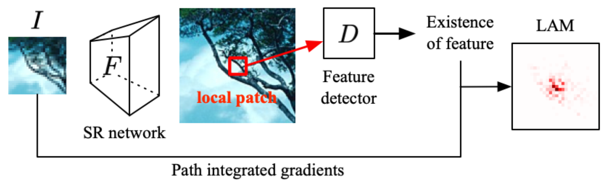
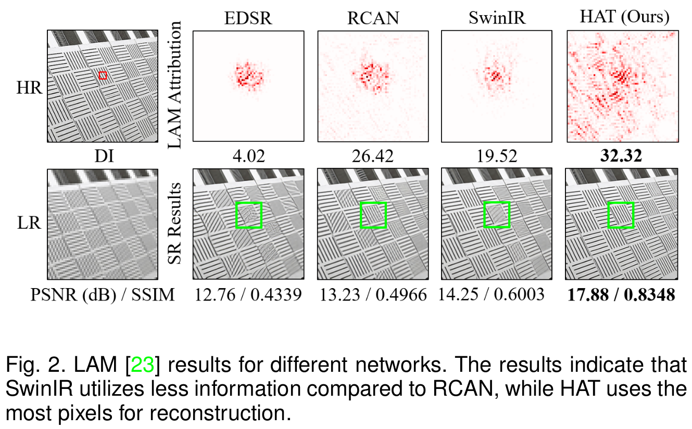
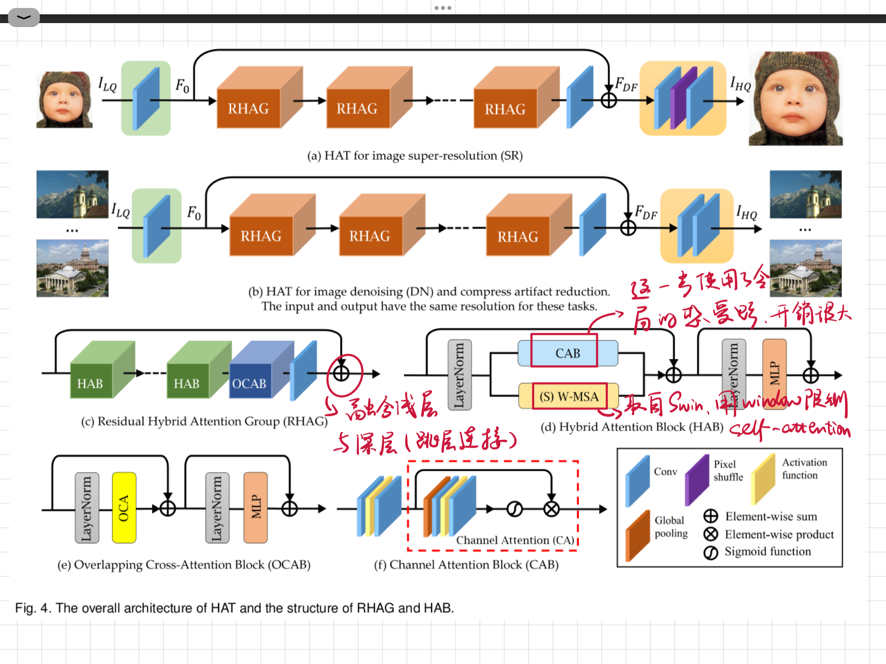

## HAT: Hybrid Attention Transformer for Image Restoration

__CVPR 2023__

__Motivation__

深度学习时代，超分辨率方向的研究不断取得进展，SOTA 被一次又一次刷新。然而 SR 研究也有着深度学习的通病：

* 到底模型学习到了什么？
* 到底是什么对模型的优异性能贡献最大？
* 感受野 (Receptive field) 决定了 HR 能看到的 LR 范围，那么是不是只要加大感受野就能获得更好的性能呢？更大的感受野，或者多尺度的特征是否对于 SR 模型有效？
* 为什么 Attention 或者 Non-local 的操作可以帮助提升 SR 性能？
* 不同的网络架构如何影响信息使用和最终性能？

因此文章首先介绍了针对 SR 领域的 Attribution Analysis (归因分析)，以更好地理解模型，从而为改进模型指明方向。

归因分析的结果一般通过归因图 (Attribution map) 的形式展示。在归因图中，对于输出产生较为重要影响的像素被 highlight 出来。通过这种方式，我们可以分析 SR 网络的信息使用模式，并评估 SR 网络是否可以提取高级语义信息。

前两个网络是 CNN-based，后两个网络是 Transformer-based。

1. Transformer has a much stronger mapping ability than CNN.
2. SwinIR can be further improved if it could exploit more input pixels.

__Methodology__

$F_0$ shallow feature; $F_{DF}$ deep feature; (S)W-MSA standard and shifted window multihead self-attention module;

属于一篇只考虑超分效果，而不考虑时耗的文章。

__训练__

文章用大型图像数据集 ImageNet 作预训练，再针对不同的使用场景进行微调。

960x540。

