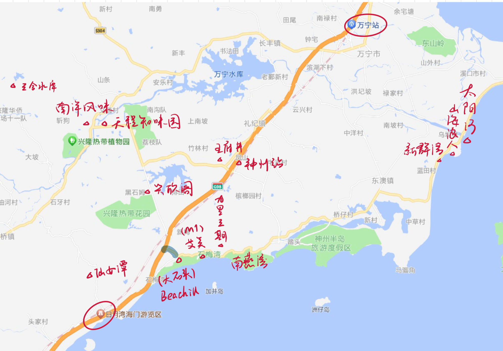

## 万宁

### 2.20 周二

上午十二点浦东飞海口，机票 391，下午三点半抵达，四点多从海口坐动车到万宁站（神洲站更方便，但是没票了）。到九里三期之后，略作休整就去找 Hank 和丫丫吃晚餐了，王府井对面的海鲜排挡，和舟山口味相似，蛮新鲜的。晚饭后，我们喝了老盐季，商量了明早的行程，就回家休息了。

### 2.21 周三

六点一大早就起床了，六点半 Hank 来接我们，先去了艾美看浪，又去了大石头看浪，都风平浪静，死心了。回 M1 喝咖啡，在丫丫的鼓动下，我们决定租一天的车，游览一下万宁市。开车先去了仙女潭，听说大胆的浪人会在这里跳水，但是我和 Chris 胆小如鼠，最后泡了会儿潭水就驱车离开了。随后我们来到了兴隆南洋风味想吃午餐，但是排队的人太多了，去了旁边的一家小破店解决。午饭过后我们步行在周围转了转，菜市场、老破房、棕榈树、铁栅栏，东南亚风味十足。接着，我们驱车前往了三合水库，盘山泥路开着颇有意思，一路颠簸终于见到海南小瑞士，草地青青、天水蓝蓝、牛儿吃草，我又第二次下水了。接下来的路程由 Chris 司机掌舵，目标山海浪人，俺睡着了，后来沿途经过了一条极为狭长的沙滩，不出意外，我第三次下水了。沙滩上有一座塔，后来据 Hank 所说，浪好的时候，一直能从新群湾冲到这儿来。山海浪人确实很美，据丫丫说看日落很绝，但我们等不到日落，就想着回家了，俩糙汉，没那么多浪漫情怀。晚餐，我们接上了 Hank 和丫丫，去了兴欣阁，价格实惠 292，聊起了山海浪人的致幻蘑菇文化。我们相约第二天一早去新群湾冲早浪。

### 2.22 周四

还是六点一早，我们起床了，六点半开车接上丫丫，直指山海浪人，借好板，换上衣服，我们就飞奔下海。今天微微有浪，但是起在礁石边上，我动作非常生疏，而且害怕撞上礁石，玩得并不是很痛快，得赶紧学会斜跑呀。上岸后，我们又去山海浪人转悠了一圈，玩了碗池，喝了啤酒，这个疯狂的高中地理老师对于酒驾这件事毫不畏惧。中午，我们把车还了，和 Hank 碰头吃了疯狂星期四，又在 M1 喝过咖啡后，就去大石头继续冲浪啦，这次我租了七尺泡沫板。晚餐我们分道扬镳，我和 Chris 点了外卖，简单了事。

不得不说，万宁的水真是漂亮，趴在板上，往岸边看，一层薄荷绿的海水，一层金黄细软的沙滩，一层幽幽葱葱深绿的树林，无数次让我感觉美得窒息；往另一边看，碧蓝的海水配上天蓝的天空，再有几朵又白又厚实的云朵，无数次让我的心感觉平静。

### 2.23 周五

今天的浪也是平平淡淡，上午用 Hank 的短板学习划水，短板好难保持平衡，我是坐不了一点，但也学到了重要一课，挺胸并腿收核心。中午吃的是水饺，下午因为也没浪，大家打起了德扑，血赚 250，开心地决定请大家吃晚餐。说是没浪，还是忍不住下海了，还是用 Hank 的短板。晚饭我们去了兴隆天程知味园，花了 482。

今日最好笑的段子。某教练：Hank 海里有个人拿着你的板子玩得很开心（疯狂练习龟翻）。Hank：浪这么好的吗？某教练：不，他是真的只是在玩。（没有浪我只能自娱自乐，嘿嘿。）

### 2.24 周六

周六上午大浪滔天，终于等到起浪了，感觉有 1.5m，我好像有点会斜跑了，好玩好玩。午餐我们吃了沙县，午睡一会儿之后，下午继续冲冲冲，浪太好啦。晚餐我和 Chris 吃了楼下的老窄巷糟粕醋火锅 298 的套餐，还行。饭后我们去了日月湾，这里的酒吧文化还可以，一排酒吧开在沙滩边，因为是元宵节，沙滩上好多人放烟火和孔明灯。可惜没有乐队表演，我们走马观花一阵后就打道回府。

### 2.25 周日

周日上午依旧大浪滔天，1.5m 能将我高高托举，还吃了一记滚筒洗衣机，划进去好累好累，但是太好玩啦。大家都能走板和回切，好强好强。中午吃了德克士，洗漱收拾，打道回府，Hank 带我们逛了王府井，晚餐吃了肯德基，坐动车回海口坐飞机啦。半个月前 1510 的机票我不信邪，一直蹲蹲，终于涨到了 2102，含泪拿下。

碰到大浪的时候，板头容易插水，Hank 说启程的时候带点角度会有帮助，下次试试。还有我起板太慢了，Hank 说越早起越好，但是我会趴太久，一直到白花区才启程。

